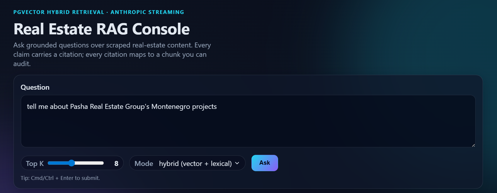

# Real Estate RAG

A production-grade Retrieval-Augmented Generation system over real-estate
content (`pasharealestate.az`). Hybrid retrieval against Postgres + pgvector,
streaming answers from Anthropic with strict citation grounding, and an
offline evaluation harness.

Built as an end-to-end portfolio piece for AI-engineering work: every stage
of the pipeline — scraping, chunking, embedding, retrieval, generation,
serving — is split into a focused module that's easy to reason about,
test, and extend.

```text
┌──────────┐   ┌──────────────┐   ┌────────────────┐   ┌──────────────┐
│ Sitemap  │──▶│  Firecrawl   │──▶│  JSONL corpus  │──▶│  Chunker +   │
│ (XML)    │   │   scraper    │   │ (data/*.jsonl) │   │  Embedder    │
└──────────┘   └──────────────┘   └────────────────┘   └──────┬───────┘
                                                              │
                                                              ▼
   ┌──────────────────────────────────────────────────────────────┐
   │  Postgres + pgvector                                          │
   │  ─────────────────────                                        │
   │  rag_chunks(id, doc_id, url, chunk_index, content,            │
   │             content_hash, metadata, embedding vector(384),    │
   │             tsv tsvector GENERATED, ...)                      │
   │                                                               │
   │  HNSW(embedding vector_cosine_ops)   GIN(tsv)                 │
   └──────────────────────────────────────────────────────────────┘
                            │
            ┌───────────────┴────────────────┐
            ▼                                ▼
   vector kNN (cosine)              tsvector ts_rank_cd
            │                                │
            └────────────┬───────────────────┘
                         ▼
              Reciprocal Rank Fusion
                         │
                         ▼
            top-K chunks  ──▶  Anthropic Claude (streaming)
                                         │
                                         ▼
                              grounded answer + [Sn] citations
```

## What's interesting (for AI engineers)

- **Hybrid retrieval, not just vectors.** The retriever runs a vector kNN
  *and* a Postgres full-text search in a single SQL CTE, then fuses ranks
  with [Reciprocal Rank Fusion](https://plg.uwaterloo.ca/~gvcormac/cormacksigir09-rrf.pdf)
  (`k=60`). RRF is rank-only, so it's robust to scale differences between
  cosine similarity and `ts_rank_cd`. There's a clean fallback to pure
  vector search when the lexical query yields no matches (stop-words only,
  proper-noun-only queries, etc.).
- **HNSW over IVFFLAT.** HNSW gives high-quality ANN with no `lists`
  hyperparameter tuning and no rebuild after bulk loads. `m=16,
  ef_construction=64` is a sane default for a 2k-chunk corpus on Neon.
- **Structure-aware chunker with overlap.** Splits on Markdown headings
  first, then paragraphs, then sentences, with a configurable overlap that
  snaps to a sentence/word boundary so cross-chunk facts can still be
  answered. The chunker enforces a *hard* `maxChars` ceiling — overlap
  drops automatically rather than letting chunks blow past the limit.
- **Idempotent ingestion.** Every chunk carries a SHA-256 of its content;
  re-running ingest skips embedding for unchanged chunks, deletes chunks
  that disappeared after re-chunking, and `ANALYZE`s the table for the
  query planner.
- **Streaming end-to-end.** Anthropic SDK's `messages.stream` → an SSE
  endpoint (`/api/ask/stream`) → an incremental DOM renderer in the
  browser. Sources arrive *first* so the UI can render citation cards
  while text is still streaming.
- **Citation contract enforced.** A cached system prompt commits the
  model to per-claim `[Sn]` citations and forbids outside knowledge.
  Citations in the UI are clickable buttons that scroll to and flash the
  matching source card.
- **Prompt caching wired up.** The system prompt uses
  `cache_control: { type: "ephemeral" }` so cache breakpoints are present
  even if the current prompt is below the model's cache threshold; longer
  system prompts or cached source bundles will benefit automatically.
- **Offline eval harness.** `npm run eval` runs a small golden set and
  reports retrieval recall, citation rate, invalid-citation count,
  per-question latency, and token totals.
- **Production wiring.** `helmet` (with a tight CSP), `compression`, an
  `express-rate-limit` per-IP gate on `/api/ask*`, `zod`-validated
  request bodies and env, structured logging via `pino`, a real
  `/api/health` that pings the database, and graceful `SIGINT/SIGTERM`
  shutdown.

## UI walkthrough

**Ask panel.** Free-text question, Top-K slider, and a retrieval-mode
selector (`hybrid` / `vector` / `lexical`) so you can A/B retrievers
without restarting the server.



**Streaming answer.** Tokens render incrementally as they arrive over
SSE. The header surfaces the model, retrieval mode, Top-K, and live
token usage. Inline `[Sn]` markers are real buttons — clicking one
scrolls to and flashes the matching source card.


**Traceable sources.** Each card shows the RRF score plus the
underlying vector and lexical scores so you can see *why* a chunk was
retrieved, alongside the page kind, language, domain, `doc_id`, chunk
index, URL, and a snippet — every claim in the answer is auditable.


## Repository layout

```
.
├── src/
│   ├── config.js     # zod-validated env → frozen typed config
│   ├── logger.js     # pino structured logger
│   ├── db.js         # pg Pool + idempotent schema (HNSW + GIN tsvector)
│   ├── embedder.js   # @xenova/transformers MiniLM, batched, normalized
│   ├── chunker.js    # heading/paragraph/sentence splitter w/ overlap
│   ├── retriever.js  # hybrid vector + BM25-ish, RRF fused
│   ├── prompt.js     # cached system prompt + citation contract
│   ├── llm.js        # Anthropic client w/ streaming + model fallback
│   ├── rag.js        # orchestration (ask + askStream)
│   └── server.js     # Express: helmet, rate-limit, SSE, health, lifecycle
├── scripts/
│   ├── scrape.js     # sitemap → JSONL via Firecrawl, atomic, retried
│   ├── ingest.js     # JSONL → pgvector, content-hash idempotent
│   ├── ask.js        # CLI streaming ask
│   └── eval.js       # offline metrics
├── eval/
│   └── eval-set.jsonl
├── web/
│   ├── index.html    # single-page UI shell
│   ├── app.js        # SSE streaming + citation interactivity
│   └── styles.css
└── data/
    └── corpus.jsonl  # scraped corpus (gitignored once regenerated)
```

## Quick start

```bash
# 1. Install
npm install

# 2. Configure
cp .env.example .env
# Fill in DATABASE_URL, ANTHROPIC_API_KEY, FIRECRAWL_API_KEY (last only for scraping).

# 3. Build the corpus (~1–3 min on a 300-page site)
npm run scrape

# 4. Ingest into pgvector (~4–5 min for ~2.5k chunks on a small Neon DB)
npm run ingest

# 5. Run the server
npm start
# → http://localhost:8787
```

CLI alternative:

```bash
npm run ask -- "Where is Mardi Mekan Estate located?"
npm run ask -- --top-k 12 --mode vector "Which projects offer townhouses?"
npm run eval
```

## Configuration

Every knob is declared in `src/config.js` with a `zod` schema, so the
process refuses to start with a missing or malformed variable. Defaults
are tuned for the included corpus; everything below is overridable via
`.env`.

| Variable | Default | Purpose |
|---|---|---|
| `DATABASE_URL` | — | Postgres + pgvector connection string. **Required.** |
| `ANTHROPIC_API_KEY` | — | Anthropic API key. **Required.** |
| `FIRECRAWL_API_KEY` | — | Firecrawl key (only used by `scripts/scrape.js`). |
| `EMBEDDING_MODEL` | `Xenova/all-MiniLM-L6-v2` | Local feature-extraction pipeline. |
| `VECTOR_DIM` | `384` | Must match the embedding model. |
| `PGVECTOR_TABLE` | `rag_chunks` | Table name (sanitized as a SQL identifier). |
| `ANTHROPIC_MODEL` | `claude-sonnet-4-5` | Default model. |
| `ANTHROPIC_MODEL_CANDIDATES` | `claude-sonnet-4-5,claude-haiku-4-5-20251001` | Fallback chain on `not_found`. |
| `RAG_MODE` | `hybrid` | `hybrid` \| `vector` \| `lexical`. |
| `RAG_TOP_K` | `8` | Final number of chunks shown to the model. |
| `RAG_CANDIDATE_K` | `24` | Candidates pulled from each retriever before fusion. |
| `RRF_K` | `60` | RRF constant. Standard value from Cormack et al. |
| `CHUNK_SIZE` / `CHUNK_OVERLAP` / `MIN_CHUNK_SIZE` | `1200` / `180` / `200` | Chunking. |
| `RATE_LIMIT_WINDOW_MS` / `RATE_LIMIT_MAX` | `60000` / `30` | Per-IP rate limiter for `/api/ask*`. |

## Schema (idempotent, applied on every ingest)

```sql
CREATE EXTENSION IF NOT EXISTS vector;

CREATE TABLE IF NOT EXISTS rag_chunks (
  id BIGSERIAL PRIMARY KEY,
  doc_id TEXT NOT NULL,
  url TEXT NOT NULL,
  chunk_index INTEGER NOT NULL,
  content TEXT NOT NULL,
  content_hash TEXT NOT NULL,
  metadata JSONB NOT NULL DEFAULT '{}'::jsonb,
  embedding vector(384) NOT NULL,
  tsv tsvector GENERATED ALWAYS AS (to_tsvector('english', content)) STORED,
  created_at TIMESTAMPTZ NOT NULL DEFAULT NOW(),
  updated_at TIMESTAMPTZ NOT NULL DEFAULT NOW(),
  UNIQUE (doc_id, chunk_index)
);

CREATE INDEX IF NOT EXISTS rag_chunks_embedding_hnsw_idx
  ON rag_chunks USING hnsw (embedding vector_cosine_ops)
  WITH (m = 16, ef_construction = 64);

CREATE INDEX IF NOT EXISTS rag_chunks_tsv_gin_idx
  ON rag_chunks USING gin (tsv);

CREATE INDEX IF NOT EXISTS rag_chunks_doc_id_idx
  ON rag_chunks (doc_id);
```

## Hybrid retrieval, in one SQL

```sql
WITH params AS (
  SELECT $1::vector AS qv,
         plainto_tsquery('english', $2) AS qt,
         $3::int AS candidate_k,
         $4::int AS rrf_k
),
vector_hits AS (
  SELECT id, ROW_NUMBER() OVER (ORDER BY embedding <=> (SELECT qv FROM params)) AS rnk
  FROM rag_chunks
  ORDER BY embedding <=> (SELECT qv FROM params)
  LIMIT (SELECT candidate_k FROM params)
),
lexical_hits AS (
  SELECT c.id,
         ROW_NUMBER() OVER (ORDER BY ts_rank_cd(c.tsv, p.qt) DESC) AS rnk
  FROM rag_chunks c, params p
  WHERE c.tsv @@ p.qt
  ORDER BY ts_rank_cd(c.tsv, p.qt) DESC
  LIMIT (SELECT candidate_k FROM params)
),
fused AS (
  SELECT id, SUM(1.0 / ((SELECT rrf_k FROM params) + rnk)) AS rrf_score
  FROM (SELECT * FROM vector_hits UNION ALL SELECT * FROM lexical_hits) r
  GROUP BY id
)
SELECT c.*, f.rrf_score
FROM fused f JOIN rag_chunks c ON c.id = f.id
ORDER BY f.rrf_score DESC LIMIT $5;
```

## API

### `GET /api/health`

Pings the database and reports the active model / dim / retrieval mode.

```json
{ "ok": true, "service": "real-estate-rag", "table": "rag_chunks",
  "embedding": { "model": "Xenova/all-MiniLM-L6-v2", "dim": 384 },
  "retrieval": { "mode": "hybrid", "topK": 8 } }
```

### `POST /api/ask`

```json
{ "question": "Where is Mardi Mekan Estate located?", "topK": 6, "mode": "hybrid" }
```

Response: `{ ok, answer, sources[], model, usage, mode, topK, stop_reason }`.

### `POST /api/ask/stream` (SSE)

Same body. Emits a sequence of `data: {...}\n\n` events:

| Event | Payload |
|---|---|
| `sources` | `{ sources: [...], mode, topK }` — sent first so the UI can render citation cards immediately. |
| `model`   | `{ model }` once the model has been selected from the fallback chain. |
| `delta`   | `{ text }` — incremental text. |
| `usage`   | `{ usage: { input_tokens, output_tokens, ... } }` |
| `done` / `end` | terminator events. |
| `error`   | `{ error }` on failure. |

The endpoint sends a `: ping\n\n` heartbeat every 15s and aborts cleanly
if the client disconnects.

## Evaluation

Run `npm run eval`. The harness measures three things over
`eval/eval-set.jsonl`:

1. **Retrieval recall.** Did at least one retrieved chunk contain the
   question's `must_match` keyword(s)?
2. **Citation rate.** Did the answer include at least one `[Sn]` marker?
3. **Citation validity.** Every cited `Sn` must exist in the retrieved
   set (a lite faithfulness check).

Latest results on the bundled 10-question set, hybrid mode, `top_k=8`,
`claude-sonnet-4-5`, default config, against the included corpus:

```
#   recall  cited  invalid  ms     question
--------------------------------------------------------------------------------
1   PASS    yes    0        10792  What is Mardi Mekan Estate?
2   PASS    yes    0        6456   Which projects offer townhouses?
3   PASS    yes    0        9033   Tell me about The Crescent Residences.
4   PASS    yes    0        10414  What is the Ritz Carlton Residences offering?
5   PASS    yes    0        5930   Are there apartments at the St. Regis Baku Residences?
6   PASS    yes    0        6612   What property types are available at Knightsbridge Residences?
7   PASS    yes    0        5746   Where is Mardi Mekan Estate located?
8   PASS    yes    0        7479   Which projects are currently available for sale?
9   PASS    yes    0        6482   What is Pasha Real Estate's portfolio?
10  PASS    yes    0        5079   How can I contact Pasha Real Estate?

AGGREGATE
---------
Retrieval recall:   10/10 (100.0%)
Citation rate:      10/10 (100.0%)
Invalid citations:  0
Avg latency:        7402 ms
Total tokens:       in=34638 out=2599
```

The eval set is intentionally small and pasha-realestate-specific. The
harness is designed to be extended with more questions and richer
metrics (per-claim faithfulness, redundancy, answer-vs-snippet ROUGE,
etc.) without touching the rest of the system.

## Operational notes

- **Embedding model load** is lazy and async; the server warms up the
  embedder + the Anthropic model list on boot so the first user request
  doesn't pay model-init cost.
- **Cold-start cost.** First scrape pulls the MiniLM model (~22MB) into
  `~/.cache/huggingface/`; subsequent runs reuse it.
- **Re-ingesting** an unchanged corpus is essentially free thanks to the
  per-chunk `content_hash` short-circuit. Changed chunks are
  re-embedded; chunks that disappeared after re-chunking are pruned.
- **Cost per question** is dominated by the LLM call (≈3.5k input
  tokens, ~250 output for top_k=8 on this corpus). The Postgres side is
  one round-trip on indexed columns. Embedding the user query is a few
  ms once the model is warm.
- **Prompt caching** is wired via `cache_control` on the system block.
  Below the model's cache threshold (1024 tokens for Sonnet) the
  breakpoint is a no-op; lengthen the system prompt or cache the
  sources block to see hits on repeat queries.

## Stack

- **Node.js** 18+ (CommonJS). No build step.
- **Express 4** + `helmet` + `compression` + `express-rate-limit`.
- **Postgres** with the [pgvector](https://github.com/pgvector/pgvector) extension.
- **`@xenova/transformers`** for local embeddings (`Xenova/all-MiniLM-L6-v2`, 384-d).
- **`@anthropic-ai/sdk`** for streaming generation.
- **`@mendable/firecrawl-js`** for sitemap-driven scraping.
- **`pino`** structured logging, **`zod`** env + request validation.
