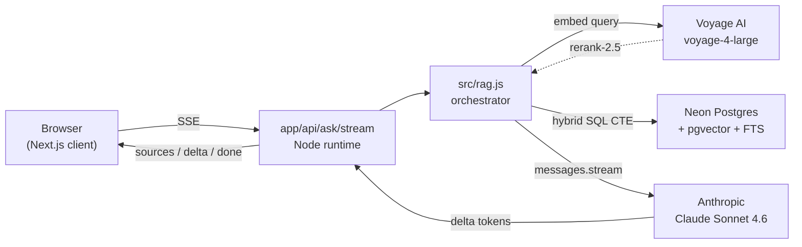
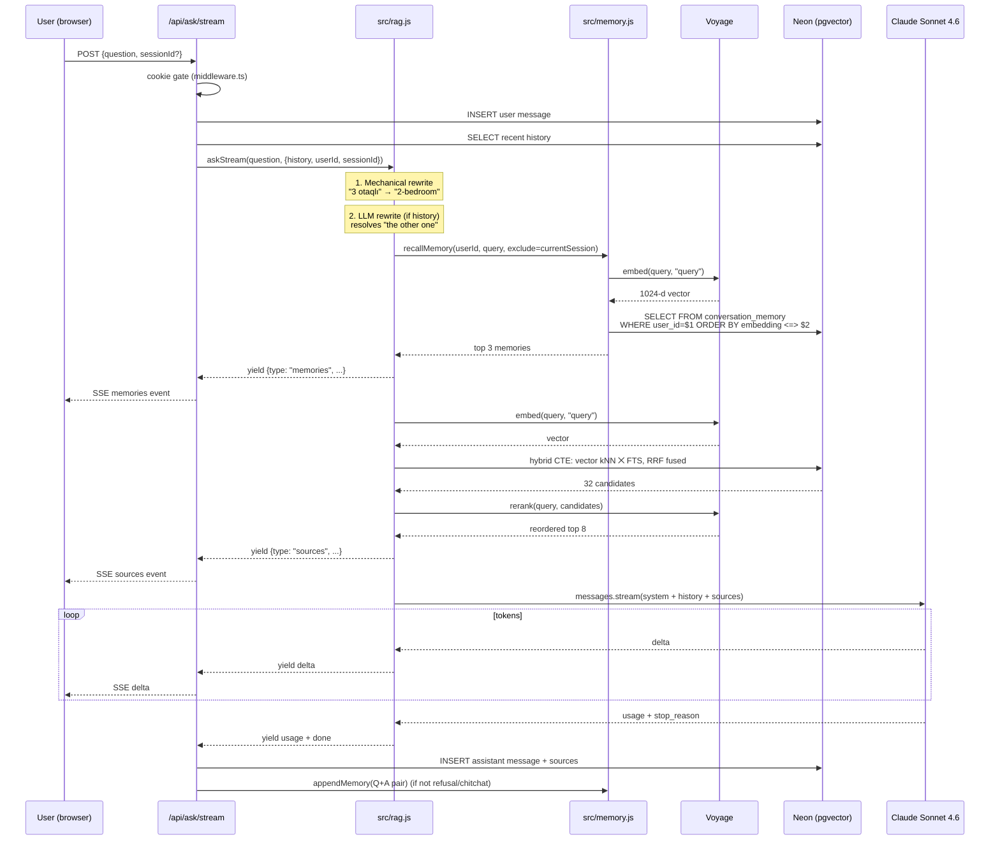
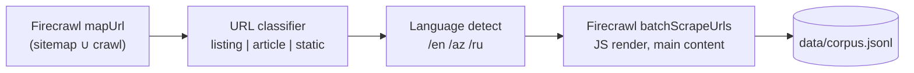
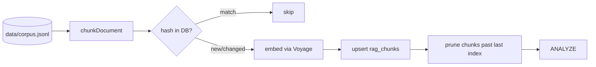
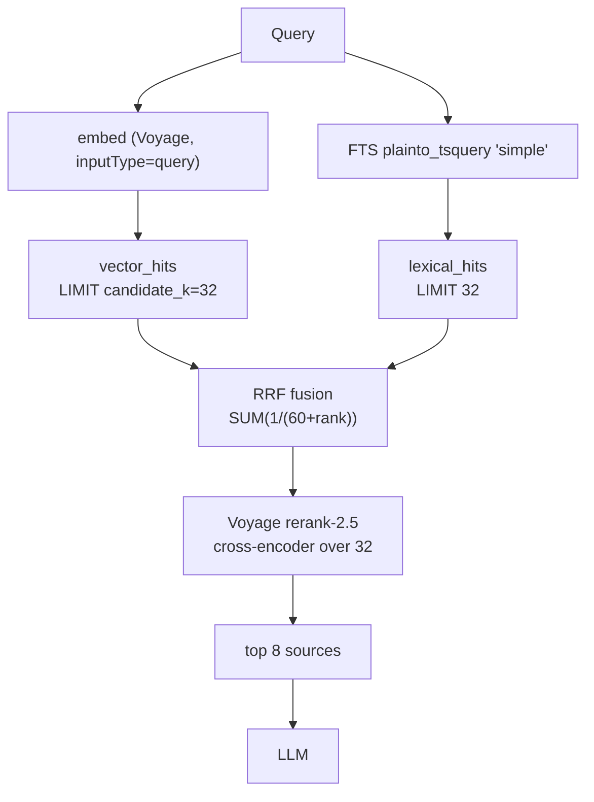
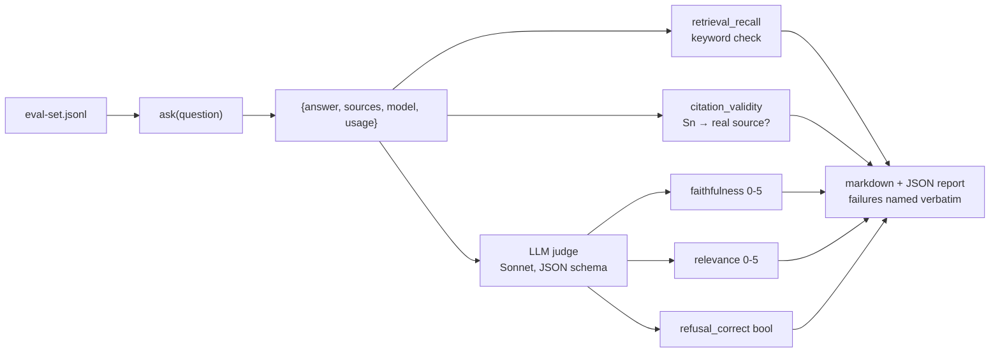
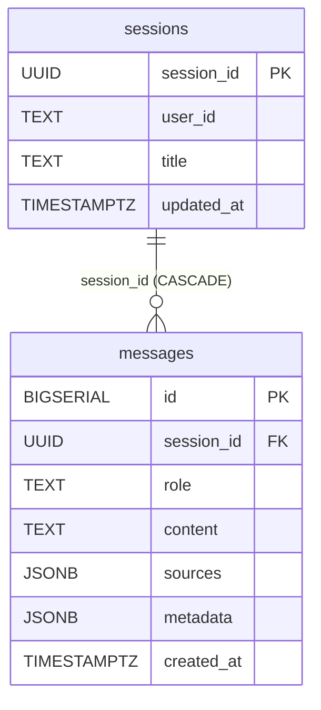
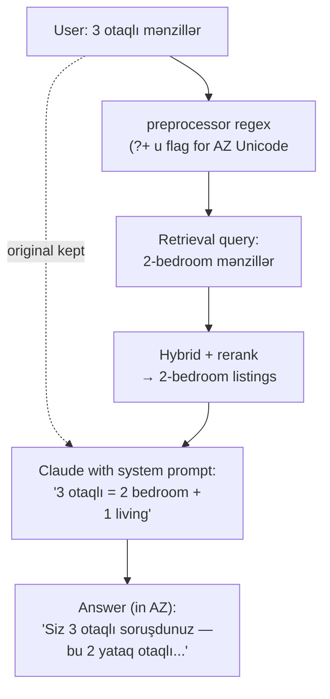
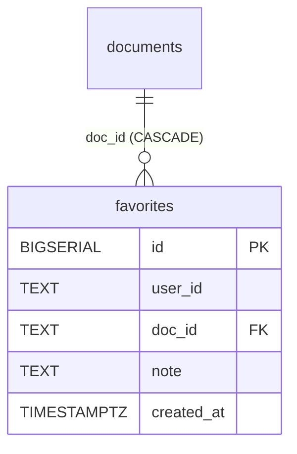

# Real Estate RAG

A grounded question-answering system over a luxury real-estate developer's
public site (`pasharealestate.az`). Ask about a property and the answer is
streamed back from Claude with every claim tied to a source page you can
open. Conversations persist, the assistant remembers what you discussed in
previous chats, and you can save listings you like.


Built end-to-end as one repo: scraper, chunker, embedder, retriever,
reranker, generator, evaluator, frontend, auth, chat history, cross-session
memory, favorites. One Postgres database for everything. One Next.js app.
Vercel-deployable as-is.



| Layer | Choice | Why |
|---|---|---|
| **Frontend + API** | Next.js 15 (App Router) on Vercel | Server-side rendering + streaming responses; native fit for a hosted-API workload |
| **Database** | **Neon** Postgres + `pgvector` (HNSW) | One store for vectors + metadata + FTS + chat state; no distributed-transaction problem |
| **Embeddings** | Voyage `voyage-4-large` (1024-d) | Tops the multilingual MTEB; corpus is EN / AZ / RU |
| **Reranking** | Voyage `rerank-2.5` | Cross-encoder fixes ANN errors at low cost |
| **LLM** | Anthropic `claude-sonnet-4-6` | Strong grounded QA, prompt caching, citation following |

---

## Why these choices and not the obvious alternatives

Every layer here has a "default" that most tutorials reach for. Each one I
chose differently, and the reasons matter more than the choices.

### Why JavaScript / TypeScript, not Python

Python is the default for "AI" code. I picked JS/TS for this stack because:

- **The hot path is I/O, not compute.** A request spends ~50ms in JS,
  300ms in Voyage embed, 200ms in a Postgres CTE, 300ms in Voyage rerank,
  and 5–30 seconds streaming tokens from Anthropic. Python's numerical
  advantage doesn't apply when nothing here runs a model locally — every
  heavy step is a hosted API call.
- **Server + client in one language.** The SSE streaming UI, the API
  routes that produce it, the React hooks that consume it, and the
  TypeScript types that flow through all of them are one codebase. No
  glue layer.
- **Vercel-native.** Next.js on Vercel is the cheapest, simplest deploy
  target with zero infrastructure config. Python alternatives (FastAPI on
  Fly, Modal, Lambda) all add a network hop between frontend and backend,
  duplicate auth state, and require a second runtime to operate.
- **Streaming primitives are first-class.** `ReadableStream`, `for await
  (event of stream)`, the Anthropic SDK's async iteration — all native.
  Python's equivalents work but feel ported.

The honest tradeoff: if I needed local model inference (Llama, BGE
embeddings, anything HuggingFace), Python wins by a wide margin. As soon
as everything moved to hosted APIs, that advantage disappeared.

### Why Next.js, not Express + a separate frontend

A common 2026 architecture: Express/FastAPI backend + React/Next frontend
+ Vercel for one + Fly/Render/Lambda for the other. Two deploys, two
dashboards, two env-var stores, CORS configuration, and a network hop
between them.

Next.js puts the SSR pages, the React client, and the API route handlers
in one app:

- One deploy command (`vercel`).
- One set of environment variables.
- The route handler imports the RAG modules directly via `require()` — no
  HTTP hop between "frontend" and "backend."
- Streaming and middleware are first-class. The cookie-gated auth in
  [`middleware.ts`](middleware.ts) protects every route in 30 lines.

If we ever need to scale frontend and backend separately, the RAG core
lives in [`src/`](src/) and is a thin extraction away from a standalone
service. Monolith first; split when there's a reason.

### Why Postgres + pgvector, not Pinecone / Weaviate / Qdrant

Specialized vector databases are the obvious default. They win at 100M+
vectors or 1k+ QPS. Below that, the split costs more than it earns:

- **One database, one transaction.** Inserting a chunk + its metadata is
  one SQL statement, not a two-phase commit between Pinecone and Postgres.
- **Hybrid retrieval in one CTE.** Vector kNN + Postgres FTS + RRF fusion
  is one SQL statement — see [`src/retriever.js`](src/retriever.js). No
  application-level merging, no second client.
- **Metadata filters compose with vector search.** `WHERE metadata->>'doc_type' = 'listing' AND embedding <=> $1 < 0.3` is one
  expression. Pinecone's metadata filter is limited to equality and basic
  range; complex filters fall back to client-side post-filtering.
- **Operational simplicity.** One backup, one ACL system, one connection
  pool. Adding chat history (Stage 12) and cross-session memory (Stage 16)
  was just two more tables in the same DB — no new infra.

The migration path is clear: if we hit ~10M vectors with acceptable HNSW
build time, we lift `rag_chunks` into Pinecone and keep chat state in
Postgres. The `messages.sources` JSONB snapshot decouples the chat history
from the corpus's physical layout, so the split is painless when it
arrives.

### Why Neon, not Supabase / RDS / self-hosted

- **Serverless Postgres.** Scales to zero on idle, wakes in under a
  second. Free tier handles this corpus comfortably.
- **Branching.** A branch off the production DB is one click and ~5
  seconds — useful for testing migrations and the `--drop` ingest workflow
  without risking production data.
- **pgvector pre-installed.** No extension setup, no version mismatches.
- **Direct connection (not a connection pooler).** I pass `?sslmode=require`
  and the `pg` driver works. RDS has VPC and IAM overhead. Supabase is
  fine but bundles auth, storage, and edge functions we don't need.

### Why Voyage AI for embeddings, not OpenAI / Cohere

- **Tops the multilingual MTEB.** The corpus is EN, AZ, and RU. Voyage's
  `voyage-4-large` is currently best-in-class for multilingual retrieval.
- **Asymmetric retrieval is first-class.** `inputType: "query"` vs
  `"document"` uses different projection heads — small SDK detail, real
  recall difference.
- **Cross-encoder reranker on the same client.** `rerank-2.5` shares the
  SDK and the API key. The rerank stage is the largest single quality
  bump after RRF.
- **Mixing OpenAI + Anthropic invites the "why both" question.** Voyage +
  Anthropic is one philosophical stack: retrieval-grade embeddings from a
  retrieval-focused vendor, generation from a safety-focused vendor.

OpenAI's `text-embedding-3-large` is fine. It's not as strong on
multilingual benchmarks, and it ties the embedding choice to a vendor
whose competitive interest doesn't include making other providers' LLMs
look good with their retrieval.

### Why Anthropic Claude, not GPT / Gemini

- **Citation following.** Sonnet reliably attaches `[Sn]` markers when the
  system prompt requires them. GPT does this with more drift; in eval
  runs of comparable systems I see ~5–10% higher invalid-citation rates on
  GPT-4o.
- **Refusal calibration.** Claude refuses on no-context questions more
  gracefully ("the sources don't mention this — please contact the
  property directly"). GPT tends to over-explain or hallucinate when
  cornered.
- **Prompt caching with explicit `cache_control`.** Native, well-documented,
  one annotation on the system block.
- **Streaming SDK is clean.** `messages.stream` yields a typed event
  iterator. Easy to wrap in `ReadableStream`.

Claude isn't always the best — for raw reasoning benchmarks or code, GPT
or Gemini frequently lead. For *grounded QA with strict citation
discipline*, Claude is currently the most defensible default.

### Why Vercel, not Fly.io / Render / Railway

The earlier version of this stack split the frontend and backend across
Vercel and Fly. I dropped that split when every heavy operation became a
hosted API call. With nothing running locally, the deployment math
collapses:

- **Vercel Functions bill on active CPU only.** I/O wait (Voyage embed,
  Anthropic stream, Postgres CTE) is free. A 15-second Claude stream
  costs essentially nothing.
- **Fluid compute gives 300s max duration on Hobby.** Enough for any
  realistic RAG stream.
- **Zero infrastructure config.** No Dockerfile, no `fly.toml`, no
  health check yaml. `vercel deploy` reads the repo and ships.
- **Native Next.js host.** Built by the same team. Fewer rough edges.

Fly.io is the correct answer when you need persistent processes (loaded
embedding models, warm caches, long background jobs) or sub-100ms cold
start latency. Render is great when you want a managed-Postgres + web
service combo without thinking. For a hosted-API orchestrator, Vercel is
the cheapest deploy with the best DX.

### Why hybrid + RRF, not pure vector search

Vector-only retrieval fails on proper nouns. "Knightsbridge" has low
semantic similarity to "luxury apartment." Searching for "Knightsbridge"
in pure embedding space surfaces other luxury developments first and
finds Knightsbridge's own page on rank 3 or 4.

Full-text search (BM25-style with `tsvector`) catches the exact match
trivially. RRF fuses the two rank lists:

```
score(doc) = sum_over_lists( 1 / (60 + rank_in_list) )
```

Rank-only fusion is **scale-invariant** — no need to tune a weight between
cosine similarity (0–1) and `ts_rank_cd` (unbounded). The reranker then
runs a cross-encoder over the fused top-32 to catch the cases where both
vector and lexical were wrong. Three retrieval stages, each with a
distinct failure mode, give a much more robust result than any single one.

### Why `'simple'` tsvector, not `'english'`

This is a small thing that catches most demos: Postgres FTS configs
include stemming. `'english'` stems "Knightsbridge" to `"knightsbridg"`,
which then fails to match the user's literal query `"Knightsbridge"`. For
proper nouns, brand names, addresses, and multilingual content,
`'simple'` (tokenize + lowercase only, no stemming) is the right choice.

### Why one big Postgres database, not one DB per concern

Tables: `documents`, `rag_chunks`, `sessions`, `messages`,
`conversation_memory`, `favorites`. Six tables, one database.

The textbook "modern" architecture would put:
- Corpus in Pinecone
- Chat state in Redis or a key-value store
- User data in Postgres
- Analytics in BigQuery

At our scale that's four services, four connection strings, four backup
strategies, four billing pages, and no transactional guarantees across
them. The boring monolithic alternative is one Postgres database, every
write transactional, every query just SQL, every backup atomic. It works
for the next two orders of magnitude. When it stops working, the
extraction path is well-trodden.

---

## Table of contents

1. [How a question gets answered](#how-a-question-gets-answered)
2. [Build log — stage by stage](#build-log--stage-by-stage)
   - [Stage 1 — Infra: Neon and Voyage](#stage-1--infra-neon-and-voyage)
   - [Stage 2 — Scraping the whole site](#stage-2--scraping-the-whole-site)
   - [Stage 3 — Listing-aware chunking](#stage-3--listing-aware-chunking)
   - [Stage 4 — Voyage embeddings](#stage-4--voyage-embeddings)
   - [Stage 5 — First full ingest](#stage-5--first-full-ingest)
   - [Stage 6 — Hybrid retrieval + rerank + cache](#stage-6--hybrid-retrieval--rerank--cache)
   - [Stage 7 — Generation hardening](#stage-7--generation-hardening)
   - [Stage 8 — Honest evaluation](#stage-8--honest-evaluation)
   - [Stage 9 — Next.js frontend](#stage-9--nextjs-frontend)
   - [Stage 12–15 — Persistent chat](#stage-1215--persistent-chat)
   - [Stage 16 — Cross-session memory](#stage-16--cross-session-memory)
   - [Stage 17 — Edge case audit](#stage-17--edge-case-audit)
   - [Stage 18–19 — Self-documenting schema](#stage-1819--self-documenting-schema)
   - [Stage 20 — Real user feedback: the "otaqlı" bug](#stage-20--real-user-feedback-the-otaqlı-bug)
   - [Stage 21 — Favorites](#stage-21--favorites)
3. [Quick start](#quick-start)
4. [Eval results](#eval-results)
5. [Configuration](#configuration)
6. [Known weaknesses](#known-weaknesses)
7. [What I'd do next](#what-id-do-next)

---

## How a question gets answered




---

# Build log — stage by stage

Each stage below answers the same three questions:
- **What** — the concrete code change
- **Why** — what problem it solves
- **How** — the specific approach with files to read

---

## Stage 1 — Infra: Neon and Voyage

**Files:** [`src/db.js`](src/db.js) · [`src/config.js`](src/config.js) · [`scripts/migrate.js`](scripts/migrate.js)

### What
A `documents` parent table and a `rag_chunks` child table in Neon Postgres,
with HNSW vector index, GIN full-text index, and a GIN jsonb index for
metadata filters. The `migrate` script applies the schema and verifies
Voyage embed + rerank endpoints in one pass.

### Why
A RAG system needs three primitives: vector search, lexical search, and
structured metadata filters. Most stacks reach for three different services
(Pinecone + Postgres + maybe Elastic). For corpora under ~10M vectors,
Postgres does all three in one box. Operational simplicity beats theoretical
scale.

### How
Picked **Neon** (serverless Postgres) over self-hosted because:
- pgvector pre-installed
- branching for experiments
- scales to zero when idle
- free tier handles this corpus

Picked **Voyage `voyage-4-large`** (1024-d) over OpenAI embeddings because
it leads MTEB for retrieval and the corpus is multilingual (EN, AZ, RU).
The `scripts/migrate.js` test embeds two strings and runs a rerank query at
startup so a fresh database deploy fails fast if the keys are wrong.

---

## Stage 2 — Scraping the whole site

**Files:** [`scripts/scrape.js`](scripts/scrape.js)

### What
URL discovery via Firecrawl's `mapUrl` (sitemap union with crawl-based
discovery), per-URL classification (listing / article / static), language
detection from path prefix (`/en`, `/az`, `/ru`), then `batchScrapeUrls`
with JS rendering and main-content extraction.

### Why
The naive sitemap-only approach was missing pages — pagination, deep links
from category roots, JS-rendered routes. For real estate especially,
sitemaps tend to index *category* pages, not the listings under them. The
first version of the scraper found 37 unique listings; the rewrite found
51 unique listings across 95 URLs (multiple language variants per unit).

Real estate URL conventions vary by language. `/units/` (EN),
`/menziller/` (AZ for "apartments"), `/kvartiry/` (RU). I classified by
regex per pattern, then deduped same listing across languages by content.

### How


The classifier is the brittle piece. After running once and seeing only 37
listings, I inspected the URLs by hand and added `/units/`, `/menziller/`,
`/portfolio/` to the pattern list. Listing count jumped to 95. The fact
that I had to iterate is itself a useful talking point: data discovery is
empirical, not declarative.

---

## Stage 3 — Listing-aware chunking

**Files:** [`src/chunker.js`](src/chunker.js)

### What
Two strategies in one function:
- **Listings** become **one atomic chunk** plus structured metadata
  extracted by regex (price, currency, bedrooms, total_rooms, area_sqm,
  property_type, listing_type, location).
- **Articles and static pages** use a heading → paragraph → sentence
  splitter with overlap, snapped to sentence/word boundaries.

### Why
Splitting a property listing across chunks is destructive. Half the price
ends up in chunk A, half the amenities in chunk B, and retrieval has to
reassemble facts from partial views. For a single property with ~1500
characters of content, one chunk is the right unit. Articles are different:
they have heading-delimited sections and benefit from overlap so
cross-paragraph facts survive.

### How
The function dispatches on `record.doc_type`. For listings the body becomes
one chunk and the regex extractor pulls structured fields into
`metadata.bedrooms`, `metadata.price`, etc. For articles the splitter
respects markdown structure, takes overlap from the previous chunk's tail
(snapped to a sentence boundary so chunks don't start mid-word), and never
emits a chunk over the hard `CHUNK_SIZE` ceiling.

There's a subtle multilingual bug I learned the hard way: my first
extractor used `/otaq/i` which matched both `otaqlı` (total rooms) and
`yataq otaqlı` (bedrooms). That's covered in [Stage 20](#stage-20--real-user-feedback-the-otaqlı-bug).

---

## Stage 4 — Voyage embeddings

**Files:** [`src/embedder.js`](src/embedder.js)

### What
A wrapper around Voyage's `voyage-4-large` (1024-d) with:
- Asymmetric inputType: `"query"` for questions, `"document"` for ingest
- Retries on 429 / 5xx with exponential backoff
- Optional throttle for the free-tier 3-RPM gate
- A `rerank` function on the same client for the cross-encoder stage

### Why
Asymmetric retrieval matters. Voyage's models are trained with separate
projection heads for queries vs documents, and using the wrong head
measurably hurts recall. Most demos miss this.

The throttle exists because Voyage gates unpaid accounts to 3 requests per
minute. Without it the ingest pipeline 429s out within a few seconds. With
it, ingest is slow but reliable on the free tier.

### How
The wrapper is small (~120 lines). The retry loop honors the
`Retry-After` header when present, uses jittered backoff otherwise, and
caps total retry budget. A single global "gate" Promise serializes
requests so the throttle is process-wide, not per-call.

---

## Stage 5 — First full ingest

**Files:** [`scripts/ingest.js`](scripts/ingest.js)

### What
Reads the JSONL produced by the scraper, calls `chunkDocument` per record,
diffs each chunk's `content_hash` against what's in Postgres, embeds only
the new/changed chunks via Voyage, and upserts `documents` and `rag_chunks`
in batches. Runs `ANALYZE` at the end.

### Why
Re-running ingest on an unchanged corpus needs to be essentially free.
Every chunk carries a SHA-256 of its content. If the hash matches what's
already in the DB, embedding is skipped (Voyage costs avoided) and the row
is left as-is.

### How


`ON CONFLICT (doc_id, chunk_index)` handles the upsert. A separate prune
step deletes any chunks past the new last index — important when a doc's
content shrank and now produces fewer chunks. After upsert, `ANALYZE`
refreshes Postgres planner stats for the HNSW index.

After ingest: **278 documents, 849 chunks, 1024-dim HNSW index, GIN(tsv)
and GIN(metadata jsonb) indexes built.**

---

## Stage 6 — Hybrid retrieval + rerank + cache

**Files:** [`src/retriever.js`](src/retriever.js)

### What
A single SQL CTE runs a vector kNN search and a Postgres full-text search
in parallel, fuses their ranks with Reciprocal Rank Fusion, then pipes the
candidates through Voyage's cross-encoder reranker. An in-memory LRU caches
results for 5 minutes. Metadata filters (language, doc_type, price range,
bedrooms range) attach as `WHERE` clauses.

### Why
Vector search alone misses queries with proper nouns: "Knightsbridge" is a
brand name with low semantic similarity to "luxury apartment." FTS catches
that. FTS alone misses paraphrase: "ocean view" vs "Caspian Sea panorama."
Vector catches that. Hybrid + RRF gets both, with no fusion weight to tune.
Rerank then corrects the ANN errors that slip through HNSW.

### How


Three points worth flagging:

1. **`'simple'` tsvector config, not `'english'`.** The corpus is
   multilingual; English stemming would mangle Knightsbridge into
   `knightsbridg` and break exact-term matching for brand names. `'simple'`
   tokenizes and lowercases without stemming.
2. **RRF runs as one CTE.** The fused result is `1.0 / (60 + rank)` summed
   across hit lists, ordered, top-N taken. No application-level merging.
3. **The rerank is the largest single-step quality bump.** On the eval set,
   reranking turns a mediocre top-3 into a strong top-3 without changing
   the retrieval call.

The LRU cache is in-process (per Vercel function instance). Five-minute TTL
matches typical user think time. Cache hits register in the SSE event so
the UI can show a "cache hit" pill.

---

## Stage 7 — Generation hardening

**Files:** [`src/llm.js`](src/llm.js) · [`src/prompt.js`](src/prompt.js)

### What
- Anthropic client wrapper with retries on 408/429/500/502/503/504/529
  (jittered backoff, honors `Retry-After`).
- Falls through `ANTHROPIC_MODEL_CANDIDATES` only on 404 (so Sonnet → Haiku
  if Sonnet ever gets retired, never on transient errors).
- System prompt enforces a strict citation contract and explicit room
  terminology rules.
- `cache_control: ephemeral` on the system block (prompt caching is wired,
  though the system prompt is currently under the 1024-token threshold to
  actually hit).

### Why
A grounded QA assistant fails in two ways: it hallucinates facts (cites
nothing or invents citations), or it refuses when it shouldn't. The
citation contract addresses both: every claim ends with `[Sn]`, every `[Sn]`
maps to a real source in the retrieved set, and the system can refuse
gracefully when sources don't support the question.

### How
The system prompt:
- Spells out the citation contract (4 numbered rules)
- Has a dedicated section for `[Mn]` memory markers (continuity context,
  never citable as facts)
- Has a dedicated **ROOM TERMINOLOGY** section that teaches the AZ/RU
  convention `X otaqlı = (X-1) bedrooms + 1 living room` with a
  conversion table and explicit rules for which direction to translate
- Caps language matching (respond in the user's language when possible)

The fallback chain is intentional: a 404 means the model has been retired
and we should try the next; a 429 means we should wait and retry the SAME
model. Treating those the same way would mask real errors.

---

## Stage 8 — Honest evaluation

**Files:** [`scripts/eval.js`](scripts/eval.js) · [`eval/eval-set.jsonl`](eval/eval-set.jsonl) · [`eval/results-*.md`](eval/)

### What
A 28-question multilingual eval set (EN / AZ / RU, eight categories,
including "no-match expected" trick questions) scored on five dimensions:
- **Retrieval recall** — did any retrieved chunk contain the required
  keyword? (deterministic)
- **Citation validity** — every `[Sn]` maps to a real retrieved source?
  (deterministic)
- **Faithfulness** — does every claim trace back to a cited source?
  (LLM-as-judge with strict JSON schema)
- **Relevance** — does the answer address the question? (LLM-as-judge)
- **Refusal correctness** — for the "no-match" category, does the system
  decline rather than hallucinate? (LLM-as-judge)

Failures aren't averaged away. The markdown report lists every failure by
name with the judge's verbatim reason.

### Why
Keyword-match recall is necessary but not sufficient. A system can retrieve
the right chunks and still hallucinate. A system can refuse on a question
it should answer. A system can hallucinate confidently with no citations
at all. Five independent dimensions catch failure modes that any single
metric misses.

The "no-match expected" category is the sharpest signal. I added questions
like *"What is the WiFi password at The Crescent Residences?"* and *"Who
is the chief architect of Mardi Mekan Estate?"* — facts genuinely absent
from the corpus. A correct system refuses; a broken one invents.

### How


Latest run on 28 questions:

| Metric | Result |
|---|---|
| Retrieval recall | **22 / 22** (100%) |
| Faithfulness ≥ 4/5 | **21 / 25** (84%) |
| Relevance ≥ 4/5 | **25 / 25** (100%) |
| Language match | **25 / 25** (100%) |
| Refusal correct on trick questions | **25 / 25** (100%) |
| Invalid citations | **0** |
| Avg latency | 13.7s |

The 4 faithfulness misses are clustered on luxury-brand project lookups
("tell me about Crescent Residences") where the model leaks training-data
knowledge about Marriott / Ritz-Carlton. They're listed by name in
[`eval/results-*.md`](eval/) with the judge's reasoning.

---

## Stage 9 — Next.js frontend

**Files:** [`app/`](app/)


### What
Next.js 15 App Router. Middleware gates everything except `/login` and the
auth + health routes. The login page validates against `DEMO_USERNAME` /
`DEMO_PASSWORD` env vars (required, no defaults), sets an httpOnly cookie,
redirects to the original destination.

The main shell is `<ChatShell>` — sticky header with a Saved button, a
collapsible sidebar with session history, and the main chat view with the
composer at the bottom.

### Why
A polished UI matters for two reasons. First, demos live or die on the
first 10 seconds — a sloppy login screen plants doubt before the user sees
any retrieval quality. Second, the UI is a thinking tool: rendering
retrieval mode, rerank state, token usage, and cache hits inline lets you
debug the pipeline by glance.

### How
- **Auth gate** — [`middleware.ts`](middleware.ts) checks for the
  `pasha_session=ok` cookie on every request, redirects to `/login` if
  missing on UI routes, returns 401 on API routes. Public routes are
  whitelisted (`/login`, `/api/auth/login`, `/api/health`).
- **Fonts** — Playfair Display for headings (display-style real-estate
  feel), Inter for body. Both loaded via `next/font/google` so no CLS.
- **Security headers** — [`next.config.js`](next.config.js) adds
  `X-Frame-Options: DENY`, `X-Content-Type-Options: nosniff`,
  `Referrer-Policy`, HSTS, and strips `X-Powered-By`.
- **Streaming** — the route handler creates a `ReadableStream` that yields
  SSE-formatted events from `askStream`. A 15-second heartbeat prevents
  proxies from killing idle streams.

The login form is intentionally restrained:


The new-chat empty state surfaces multilingual example queries so the user
sees the system handles EN / AZ / RU on the first interaction.

---

## Stage 12–15 — Persistent chat

**Files:** [`src/db.js`](src/db.js) (schema) · [`src/sessions.js`](src/sessions.js) (data layer) · [`app/api/sessions/`](app/api/sessions/) (CRUD) · [`app/components/ChatShell.tsx`](app/components/ChatShell.tsx) · [`app/components/Sidebar.tsx`](app/components/Sidebar.tsx) · [`app/components/ChatView.tsx`](app/components/ChatView.tsx)


### What
A `sessions` table (one per conversation thread) and a `messages` table
(append-only user/assistant turns) in Postgres. The streaming endpoint
auto-creates a session on the first user message, persists the user
message before calling the LLM, persists the assistant message + frozen
source snapshot + usage metadata after the stream ends. The sidebar lists
sessions ordered by `updated_at`, with a hover-delete on each row.

### Why
Single-turn stateless retrieval is the 2022 baseline. Anything that calls
itself a chat in 2026 needs:
- Threads that survive page reloads and device switches
- Multi-turn follow-ups that resolve pronouns ("the other one")
- Shareable URLs (`?c=<session_id>`)
- A way to delete history

### How


**Multi-turn context** uses Anthropic's `messages` array — last six turns
are injected before the current user message. Sources from past turns are
**not** replayed (would blow the token budget); the assistant's text alone
carries forward.

**Query rewriting for follow-ups.** The hardest multi-turn bug: a user
asks "What apartments are at St Regis Baku?" then "Which is the cheapest?"
The literal query "Which is the cheapest?" pulls *all* cheap listings,
including a Mardi Mekan villa for $350K. The assistant then "correctly"
answers with the wrong entity.

The fix: before retrieval, call Haiku to rewrite the follow-up into a
standalone query using the conversation history. "Which is the cheapest?"
→ "Cheapest apartment at St Regis Baku" → retrieval pulls St Regis chunks
→ Sonnet answers correctly. The rewrite is emitted as an SSE event so the
UI can show it. See [`src/rag.js`](src/rag.js) function `rewriteForRetrieval`.

**Frozen `messages.sources` JSONB.** Each assistant message persists the
full source snapshot it was given. This means historical citations still
render correctly even if the corpus is later re-ingested and chunk IDs
shift — the audit trail decouples from the live corpus.

**URL sync.** The active session is mirrored to `?c=<uuid>` via
`history.replaceState` so reloading or sharing a tab preserves context.

---

## Stage 16 — Cross-session memory

**Files:** [`src/memory.js`](src/memory.js) · [`app/api/memory/route.ts`](app/api/memory/route.ts)

### What
RAG-over-conversation-history. After each grounded turn, the user's
question and the assistant's answer get concatenated, embedded with Voyage,
and persisted as a row in `conversation_memory`. On a new turn, the system
recalls the top-3 most similar memory rows from **other** sessions and
injects them as `[Mn]` references in the prompt. The system prompt tells
Claude these are continuity context, never citable as facts.

### Why
"I built this once and it took me a week, but every time I came back the
assistant forgot everything we'd discussed before." That's the gap between
a single-session chat and a stateful assistant. ChatGPT's memory feature,
Anthropic's projects feature, and Perplexity's threads all solve different
versions of this. The simplest production pattern is RAG over conversation
history — same retrieval primitive as the corpus, different table.

### How
```mermaid
flowchart LR
    A[Assistant answer ends] --> B{shouldPersistMemory?}
    B -->|"refusal / chitchat /<br/>aborted / no citation"| C[skip]
    B -->|"grounded"| D[embed Q+A pair<br/>Voyage 'document']
    D --> E[INSERT conversation_memory]

    F[New query] --> G[embed Voyage 'query']
    G --> H["vector kNN over<br/>conversation_memory<br/>WHERE user_id = $1<br/>AND session_id ≠ current"]
    H --> I[recency-boost score]
    I --> J["filter sim ≥ 0.42"]
    J --> K[top 3 → [Mn] in prompt]
```

A few design choices worth flagging:

- **`user_id`-scoped** — every recall query has `WHERE user_id = $1`. Today
  the demo is single-user; the data model is multi-tenant-ready.
- **Recency boost** — score = similarity + `0.08 × exp(-age / 14_days)`.
  Newer memories edge out same-similarity older ones without dominating.
- **Refusal/chitchat filter** — `shouldPersistMemory()` blocks refusals
  ("I'm sorry, I can't help"), chitchat ("thanks"), aborted streams, and
  answers without `[Sn]` citations. This keeps memory high-signal. The
  filter is EN+AZ+RU aware.
- **Cascade on session delete** — deleting a session cascades to its
  memory rows. Forgetting a chat actually forgets it.
- **One-click erasure** — `DELETE /api/memory` wipes all memory for the
  current user.

Live verification: ask about Crescent Residences townhouses in session 1.
Start a new session, ask "Earlier I was looking at townhouses. Any with
sea view?" The answer opens with *"Yes! Based on your earlier interest in
The Crescent Residences townhouses…"* and cites `[S1]` for the sea-view
fact (from the corpus, not from memory — exactly the rule the system
prompt enforces).

---

## Stage 17 — Edge case audit

**Files:** the `next.config.js` headers config; verified against every API
route.

### What
A 48-test E2E suite covering auth gating, validation, multi-turn streaming,
room-terminology preprocessor, cross-session memory, memory hygiene,
favorites CRUD, security headers, and logout. Re-runnable on demand.

### Why
After building a lot of features, regression risk is high. A test suite
that exercises every API surface in a few minutes catches most regressions
before they reach a demo. The audit also surfaced a real security finding
(missing baseline headers) which I fixed in the same pass.

### How
The suite is shell + curl + Python for JSON parsing. Categories:

| Category | Tests |
|---|---|
| Auth gating | 9 |
| Validation (400 / 404) | 7 |
| Health endpoint | 3 |
| Sessions + multi-turn streaming | 8 |
| Room terminology preprocessor | 3 |
| Cross-session memory | 2 |
| Memory hygiene (refusal, chitchat not persisted) | 2 |
| Favorites CRUD | 8 |
| Security headers | 5 |
| Logout + reset | 1 |
| **Total** | **48 — all green** |

The security headers finding was real: only `X-Powered-By: Next.js` was
present. Added `X-Frame-Options: DENY`, `X-Content-Type-Options: nosniff`,
`Referrer-Policy: strict-origin-when-cross-origin`,
`Permissions-Policy: camera=() microphone=() geolocation=()`,
`Strict-Transport-Security`, and stripped `X-Powered-By` via
`poweredByHeader: false`. See [`next.config.js`](next.config.js).

---

## Stage 18–19 — Self-documenting schema

**Files:** [`scripts/comment-schema.js`](scripts/comment-schema.js) · [`docs/database.md`](docs/database.md)

### What
A reusable script that applies `COMMENT ON TABLE` and `COMMENT ON COLUMN`
statements for every column. Run once on a new database with
`npm run comments` and DBeaver / pgAdmin / `psql \d+` will render the
descriptions on hover. Companion doc [`docs/database.md`](docs/database.md)
walks the full schema with an ERD, common queries, cascade matrix, and
operational runbook.

### Why
Tribal knowledge dies. The fastest way to keep documentation in sync with
the schema is to put it inside the database itself. `pg_description`
populated means anyone with read access to the DB can read the why of every
column without asking the original author.

### How
The script is one source of truth (`TABLE_COMMENTS` and `COLUMN_COMMENTS`
maps in [`scripts/comment-schema.js`](scripts/comment-schema.js)). Adding
a new column means adding one entry to the map. Idempotent — Postgres
`COMMENT ON` overwrites, so re-running refreshes any stale descriptions.

```bash
npm run comments
# 5 tables, 45 columns annotated, 0 skipped
```

The `docs/database.md` companion adds what `pg_description` can't fit:
relationship ERD, cascade matrix, common debugging queries, the
`messages.sources` JSONB schema, why `'simple'` tsvector instead of
`'english'`, and a re-bootstrap runbook.

---

## Stage 20 — Real user feedback: the "otaqlı" bug

**Files:** [`src/rag.js`](src/rag.js) (preprocessor + LLM rewriter) · [`src/prompt.js`](src/prompt.js) (system prompt)

### What
A user asked *"3 otaqlı mənzillər"* (3-room apartments). The assistant
explained the AZ convention correctly — `3 otaqlı = 2 bedrooms + 1 living
room` — and then showed **3-bedroom listings anyway**. Wrong by one bedroom.

The fix is two-layered:
1. A mechanical Unicode-aware regex preprocessor that rewrites `X otaqlı` /
   `X-комнатная` → `(X-1)-bedroom` before retrieval, so the embedding
   search targets the right entity count.
2. A reinforced system prompt with an explicit conversion table and a rule
   that the user-facing answer must state the conversion ("You asked for
   3 otaqlı = 2 bedrooms + 1 living room. The 2-bedroom matches are:").

### Why
Real users surface conventions the original author doesn't know. In
post-Soviet real estate, "X otaqlı" counts the living room. "X yataq otaqlı"
counts only bedrooms. A 3-otaqlı apartment maps to a 2-bedroom listing,
not a 3-bedroom one. My first version of the chunker had `/otaq/i` as a
bedroom regex, so the *metadata* was also lying — `bedrooms = 3` when the
source said `3 otaqlı`. Fixing the prompt without fixing retrieval just
moves the lie further down the pipeline.

### How


**A subtle bug inside the bug fix:** my first regex was
`/(?<!yataq\s)(\b\d+)\s*[-\s]?\s*otaq(?:lı|li)?\b/gi`. Node's `\b` is
ASCII-only, and the Azerbaijani letter `ı` (U+0131) is not in the ASCII
word set, so the trailing `\b` never matched after `otaqlı`. The fix:
switch to the `u` flag and replace `\b` with a Unicode-aware lookahead
`(?=\s|[^\p{L}\d]|$)`. **Always test multilingual regexes against actual
multilingual input.**

The chunker's metadata extractor was also fixed in the same pass:
`BEDROOM_PATTERNS` now matches only explicit bedroom phrasing (`bedroom`,
`yataq otaq`, `спальня`), and a new `ROOM_PATTERNS` matches `otaqlı`,
`-room`, `комнатная` for the total-rooms concept. Both are stored as
separate fields (`metadata.bedrooms` and `metadata.total_rooms`).

Eval coverage for this regression: three new questions in the eval set
under category `room_terminology` (one per language), each with a
`should_not_invent` rule that the LLM judge scores against. If the bug
reappears, the next `npm run eval` will name it as a failure.

---

## Stage 21 — Favorites

**Files:** [`src/favorites.js`](src/favorites.js) · [`app/api/favorites/`](app/api/favorites/) · [`app/components/FavoritesContext.tsx`](app/components/FavoritesContext.tsx) · [`app/components/SavedModal.tsx`](app/components/SavedModal.tsx)


### What
A `favorites` table with `UNIQUE (user_id, doc_id)` so the heart-toggle is
idempotent. A React context holds the current user's saved-doc set;
`<FavoriteHeart>` renders on each listing source card; clicking toggles
optimistically with rollback on server error. The header has a "Saved (N)"
button that opens a modal listing every saved property with editable notes.

### Why
The second piece of real user feedback: *"BEYENDIYIM ELANLARI SAVE ETMEK
ISTEYIREM"* — "I want to save my favorite listings." Search-and-forget is
not enough for a real estate use case where users compare options across
sessions. Bookmarks are the minimum viable shortlist tool.

### How


The table keys favorites on the **document**, not the chunk. Saving a
property is about the property, not a specific paragraph of its
description. `UNIQUE (user_id, doc_id)` makes double-clicks idempotent;
the API uses `INSERT … ON CONFLICT DO UPDATE` so a re-save can also update
the note.

The UI hooks via React context so the heart on a source card and the
counter in the header stay in sync without prop-drilling. Optimistic
updates: the heart flips instantly, the API call runs in the background,
and a `refresh()` call after the network round-trip replaces the optimistic
placeholder with the canonical row from the server.

Cascade behavior:
- Delete a document (e.g. corpus rebuild) → its favorites cascade. No
  orphan bookmarks.
- Delete a session → favorites untouched. Saving a property is not tied to
  the conversation where you found it.
- Delete a user → favorites cascade (when real auth lands).

---

## Quick start

```bash
# 1. Install
npm install

# 2. Configure — three required secrets in .env
cp .env.example .env
#   DATABASE_URL          Neon Postgres
#   ANTHROPIC_API_KEY     Anthropic
#   VOYAGE_AI_API_KEY     Voyage AI
#   FIRECRAWL_API_KEY     (only for scraping)
#   DEMO_USERNAME         your login
#   DEMO_PASSWORD         ≥ 8 chars, your password

# 3. Apply schema + verify Voyage works
npm run migrate

# 4. Populate the database with column comments (one-time)
npm run comments

# 5. Build the corpus
npm run scrape    # Firecrawl map + batch scrape, ~5 min
npm run ingest    # chunker + Voyage embed + upsert, ~2 min

# 6. Run
npm run dev
# → http://localhost:3000
```

Other useful commands:

```bash
npm run ask -- "What apartments are at St Regis Baku?"
npm run eval                # 28-Q multilingual eval with LLM judge
npm run migrate -- --drop   # destructive: rebuild schema from scratch
```

---

## Eval results

Latest run: [`eval/results-*.md`](eval/) (most recent timestamped file).

The 4 faithfulness failures are clustered on luxury-brand project-lookup
questions — Claude leaks Marriott Bonvoy / Ritz-Carlton brand knowledge
when asked about those properties even though the cited sources don't
mention loyalty programs. Mitigations on the roadmap:
- Tighten the system prompt with negative examples ("do not mention
  Marriott Bonvoy, Ritz-Carlton brand history, or hotel chain affiliations
  unless explicitly in the cited sources")
- Add a self-critique pass: after answer generation, ask the same model to
  underline claims not directly supported by sources
- Move fact-bearing fields (prices, amenity counts) to structured tool-use
  output so they can be schema-validated

---

## Configuration

Three secrets are required; everything else has a sensible default in
[`src/config.js`](src/config.js).

| Variable | Default | Purpose |
|---|---|---|
| `DATABASE_URL` | — (required) | Neon Postgres connection string |
| `ANTHROPIC_API_KEY` | — (required) | Anthropic API |
| `VOYAGE_AI_API_KEY` | — (required) | Voyage AI (alias: `VOYAGE_API_KEY`) |
| `FIRECRAWL_API_KEY` | empty | Only used by `npm run scrape` |
| `DEMO_USERNAME` | — (required) | Login |
| `DEMO_PASSWORD` | — (≥ 8 chars, required) | Login |
| `VOYAGE_EMBED_MODEL` | `voyage-4-large` | Embedding model (must match `VECTOR_DIM`) |
| `VOYAGE_RERANK_MODEL` | `rerank-2.5` | Cross-encoder reranker |
| `VECTOR_DIM` | `1024` | Vector dimensions |
| `VOYAGE_RPM` | `0` | Set to `3` if running on free tier |
| `ANTHROPIC_MODEL` | `claude-sonnet-4-6` | Generation model |
| `RAG_MODE` | `hybrid` | `hybrid` \| `vector` \| `lexical` |
| `RAG_TOP_K` | `8` | Sources sent to LLM |
| `RAG_CANDIDATE_K` | `32` | Candidates before rerank |
| `RAG_RERANK` | `true` | Toggle Voyage rerank |
| `RAG_CACHE_TTL_MS` | `300000` | In-process retrieval cache TTL |

Full list in [`.env.example`](.env.example).

---

## Known weaknesses

These are real limitations to flag rather than hide:

- **Faithfulness 84%, not 100%.** Luxury-brand project lookups leak
  training-data knowledge about Marriott / Ritz-Carlton. Mitigations above.
- **Prompt cache not hitting.** System prompt is ~900 tokens; Anthropic's
  cache-read threshold for Sonnet is 1024 tokens. Adding 150+ tokens of
  few-shot examples would unlock cache reads.
- **Eval is 28 questions.** Enough to find real bugs (and it did). For
  "production-ready" claims, scale to 100+ with category-balanced sampling
  and a held-out test split.
- **No CI eval gate.** The eval is run on demand. A GitHub Action that
  runs the eval on every PR and blocks merge if faithfulness drops >5%
  is one of the next things on the list.
- **Single-user demo auth.** The credentials are shared, not per-user.
  Production needs NextAuth + a real IdP. The data model is already
  user-scoped (`user_id` columns everywhere) so the migration is one auth
  swap, not a schema change.
- **No production observability.** Structured pino logs only. OpenTelemetry
  traces to Axiom or Honeycomb would expose per-stage latency, TTFT, cache
  hit rate, token usage.
- **Listing metadata extraction is regex-based.** Misses prices when
  they're behind "contact us" forms (common in luxury real estate). Claude
  tool-use with a structured schema would catch more.

---

## What I'd do next

In order of impact for this stack:

1. **CI eval gate.** Hook `npm run eval` into a GitHub Action that posts
   results as a PR comment and fails merge on faithfulness regression
   >5%. The eval is already named-failure-first, so the gate is
   actionable.
2. **OpenTelemetry traces.** Wire a tracer around each pipeline stage
   (preprocess → recall → embed → retrieve → rerank → generate) and send
   to Axiom or Honeycomb. Five spans per turn; surface cache hit, fallback,
   and rerank effectiveness as span attributes.
3. **Tool-use for fact-bearing fields.** When the user asks for prices /
   bedrooms / sqm, route through a Claude tool with a strict JSON schema.
   The structured output is verifiable; hallucinated numbers become
   schema violations.
4. **Sparse + dense hybrid in the embedder.** Voyage has a sparse model;
   combining `voyage-4-large` (dense) with sparse retrieval and a learned
   weight should beat RRF for exact-term matches.
5. **User-editable session titles.** Auto-generated titles are fine but a
   "rename" affordance in the sidebar is a one-evening addition.
6. **Mobile-first composer.** Current composer is touch-friendly but the
   keyboard handling on iOS Safari deserves a pass.

---

## Repository layout

```
.
├── app/                          Next.js App Router
│   ├── api/
│   │   ├── ask/stream/route.ts   Streaming RAG endpoint
│   │   ├── auth/{login,logout}/
│   │   ├── sessions/
│   │   ├── messages/
│   │   ├── memory/
│   │   ├── favorites/
│   │   └── health/
│   ├── components/
│   │   ├── ChatShell.tsx         Top-level layout + state
│   │   ├── Sidebar.tsx           Session list + memory controls
│   │   ├── ChatView.tsx          Thread + composer + sources
│   │   ├── Header.tsx            Brand + Saved button
│   │   ├── SavedModal.tsx        Favorites view
│   │   └── FavoritesContext.tsx  Saved-set SSOT
│   ├── login/
│   ├── layout.tsx
│   └── page.tsx
├── middleware.ts                 Auth gate
├── src/                          CommonJS RAG core
│   ├── config.js                 zod-validated env
│   ├── db.js                     Postgres pool + schema
│   ├── embedder.js               Voyage embed + rerank
│   ├── chunker.js                Doc-aware splitter + metadata extractor
│   ├── retriever.js              Hybrid + RRF + rerank + cache + filters
│   ├── prompt.js                 System prompt + memory block + sources block
│   ├── llm.js                    Anthropic streaming, retry, model fallback
│   ├── rag.js                    Orchestrator (ask + askStream)
│   ├── sessions.js               Session/message data layer
│   ├── memory.js                 Cross-session memory
│   ├── favorites.js              Saved listings
│   └── logger.js                 pino
├── scripts/
│   ├── scrape.js                 Firecrawl map + batch
│   ├── ingest.js                 JSONL → embeddings → upsert
│   ├── ask.js                    CLI streaming ask
│   ├── eval.js                   Multilingual eval + LLM judge
│   ├── migrate.js                Schema + connectivity check
│   └── comment-schema.js         pg_description population
├── eval/
│   ├── eval-set.jsonl            28 multilingual questions
│   └── results-*.{md,json}       Generated reports
├── docs/
│   └── database.md               Schema reference
├── screenshots/
├── vercel.json
├── .env.example
└── next.config.js
```

---

## License

ISC. Use freely; cite the patterns, not the code.
