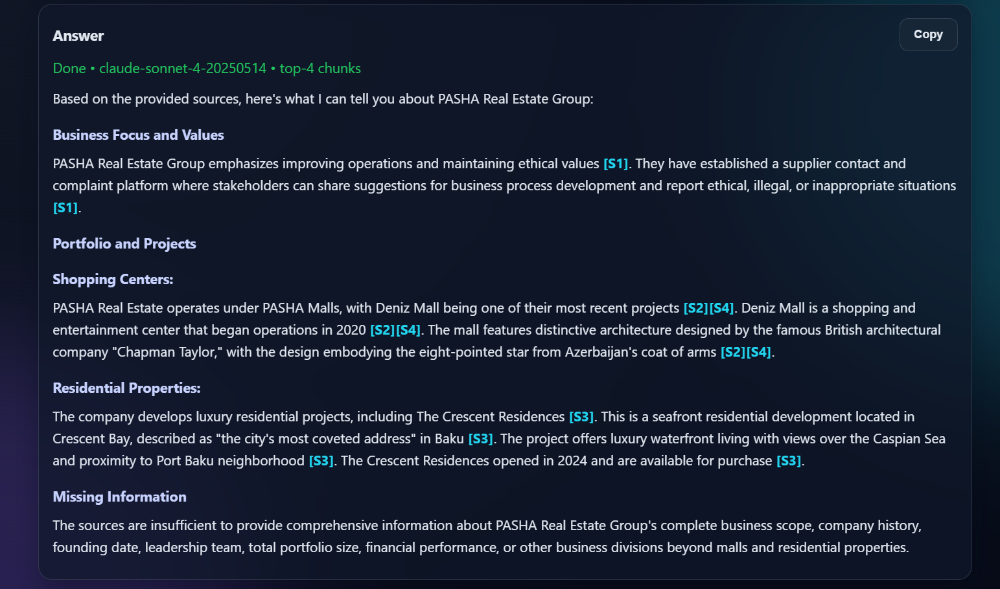

# Real Estate RAG Console

End-to-end Retrieval-Augmented Generation (RAG) app for real-estate content: scrape website pages, build chunk embeddings in PostgreSQL/pgvector, and answer user questions with traceable citations.

## What this project does

1. **Collects source pages** from a sitemap with Firecrawl.
2. **Builds a JSONL corpus** (`id`, `url`, `text`, `metadata`).
3. **Chunks + embeds content** with `@xenova/transformers`.
4. **Stores vectors in pgvector** for semantic retrieval.
5. **Answers questions with Anthropic** using retrieved chunks only.
6. **Shows traceable sources in UI** (score, doc id, chunk id, URL, metadata).

## Project structure (explained)

| Path | Purpose |
|---|---|
| `app/server.js` | Express server: serves frontend and exposes `/api/ask` + `/api/health`. |
| `app/rag-core.js` | RAG engine: query embedding, pgvector retrieval, metadata normalization, prompt assembly, Anthropic completion. |
| `scripts/build-rag.js` | Sitemap crawling + Firecrawl scraping; outputs RAG-ready JSONL. |
| `scripts/ingest-pgvector.js` | Reads JSONL, chunks text, computes embeddings, creates/updates pgvector table. |
| `scripts/ask-rag.js` | CLI query tool for quick terminal testing of answers + sources. |
| `web/index.html` | UI shell (question, answer panel, traceable sources section). |
| `web/app.js` | Frontend logic: ask API, render normalized answer markdown, render source cards safely. |
| `web/styles.css` | Console styling (layout, cards, score bars, responsive behavior). |
| `rag-ready.jsonl` / `data/rag-ready.jsonl` | Scraped document corpus used for ingestion. |
| `rag_export/` | Separate Git working directory for export-only artifacts (currently empty). |
| `.env` | Runtime configuration (API keys, DB, model/chunk settings). |

## Runtime flow

```text
Sitemap -> Firecrawl scrape -> JSONL docs
JSONL docs -> chunking + embeddings -> pgvector table
User question -> query embedding -> top-K chunks
Top-K chunks -> Anthropic prompt -> grounded answer + citations
```

## Requirements

- Node.js 18+
- PostgreSQL with `pgvector` extension
- Firecrawl API key
- Anthropic API key

## Environment variables

Create `.env` in project root:

| Variable | Required | Description |
|---|---|---|
| `DATABASE_URL` | Yes | PostgreSQL connection string. |
| `ANTHROPIC_API_KEY` | Yes | Anthropic API key for answer generation. |
| `FIRECRAWL_API_KEY` | Yes (for scrape step) | Firecrawl API key for data collection. |
| `EMBEDDING_MODEL` | No | Default: `Xenova/all-MiniLM-L6-v2`. |
| `VECTOR_DIM` | No | Default: `384`; must match embedding model output dimension. |
| `PGVECTOR_TABLE` | No | Default: `rag_chunks`. |
| `RAG_TOP_K` | No | Default retrieval depth (default 8). |
| `RAG_MAX_TOKENS` | No | Max answer tokens for Anthropic (default 900). |
| `CHUNK_SIZE` | No | Max chars per chunk in ingestion (default 1200). |
| `MIN_CHUNK_SIZE` | No | Min chunk merge threshold (default 200). |
| `INGEST_BATCH_SIZE` | No | DB upsert batch size (default 25). |
| `INPUT_JSONL` | No | Override ingestion input file path. |
| `OUTPUT_JSONL` | No | Override scrape output path. |
| `ALLOW_INSECURE_SITEMAP_TLS` | No | `1` disables TLS validation for sitemap fetch (debug only). |

## Install

```bash
npm install
```

## Commands

| Command | What it does |
|---|---|
| `npm run build-rag` | Scrapes sitemap pages and writes JSONL corpus. |
| `npm run ingest-pgvector` | Builds embeddings and ingests chunks into pgvector. |
| `npm run start` | Starts the web app (`http://localhost:8787`). |
| `npm run ask-rag -- "question"` | Asks from CLI and prints answer + traceable sources. |

## Typical local workflow

```bash
npm run build-rag
npm run ingest-pgvector
npm run start
```

Then open `http://localhost:8787`.

## UI walkthrough

### Ask a question
The query panel supports free-text prompts and a `Top K` slider to control retrieval depth.


### Answer panel
Answers are rendered in a readable format and include inline citation markers (for example, `[S1]`, `[S2]`) tied to retrieved chunks.



### Traceable Sources
Each source card shows similarity score, URL, `doc_id`, chunk index, metadata tags, and a snippet so responses can be audited.


## API reference

### `GET /api/health`
- Returns `{ ok: true }`

### `POST /api/ask`
Request body:

```json
{
  "question": "What premium projects are in Baku?",
  "topK": 8
}
```

Response includes:
- `answer`
- `sources[]` with `sid`, `score`, `url`, `doc_id`, `chunk_index`, `snippet`, `metadata`
- `topK`
- `model`

## Notes

- The system is configured for **grounded answers only** (prompt instructs model to use provided sources).
- Source metadata is normalized in backend and surfaced in UI cards for better traceability.
- For production hosting, heavy local embedding inference (`@xenova/transformers`) may be unsuitable for serverless environments without refactoring.
