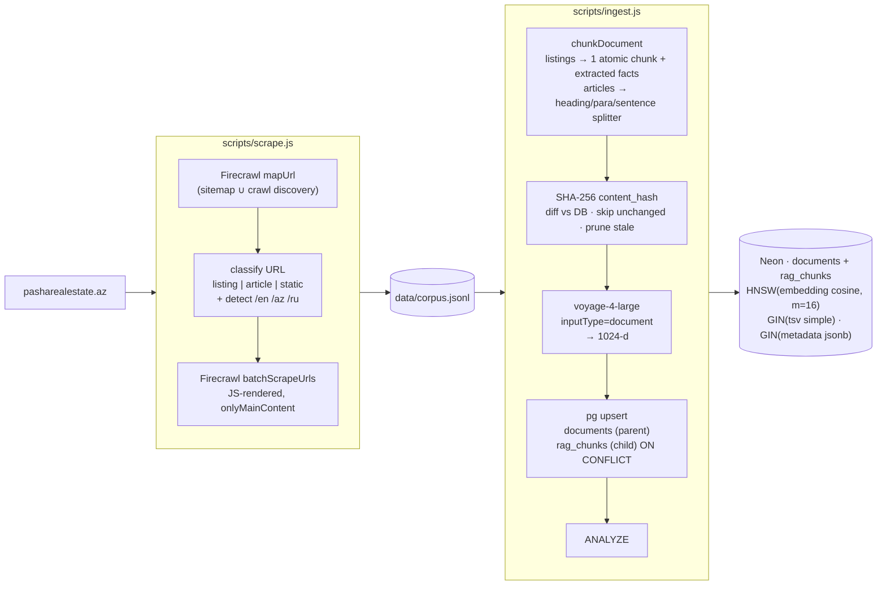
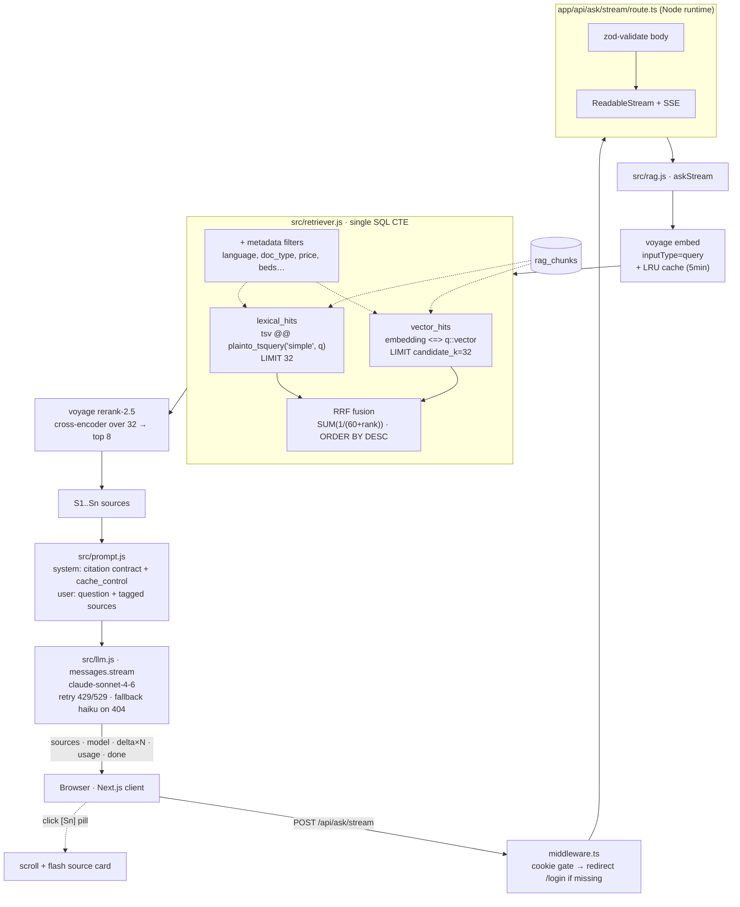

# Real Estate RAG

A production-ready Retrieval-Augmented Generation system over real-estate
content from `pasharealestate.az` — a curated luxury developer in Baku
(Crescent Residences, St.&nbsp;Regis Baku, Knightsbridge, Ritz-Carlton
Residences, Mardi Mekan Estate). Built as a portfolio piece to demonstrate
end-to-end AI infrastructure: discovery, ingest, hybrid retrieval with
cross-encoder rerank, streaming generation with citation grounding, and
honest multilingual evaluation.

| Layer | Choice | Why |
|---|---|---|
| **Frontend + API** | Next.js 14 (App Router) on **Vercel** | Hosted-API workload, 300s function duration, billing on active CPU only. One repo, one deploy. |
| **Database** | **Neon** Postgres + `pgvector` (HNSW) | Single store for vectors + metadata + FTS. No distributed-transaction problem. Branching for experiments. Scales to zero. |
| **Embeddings** | Voyage `voyage-4-large` (1024-d) | Top of MTEB for multilingual; corpus is EN / AZ / RU. 200M free tokens. |
| **Reranking** | Voyage `rerank-2.5` | Cross-encoder fixes ANN errors on the candidate set. ~$0.05/1k queries. |
| **LLM** | Anthropic `claude-sonnet-4-6` | Strong grounded QA, prompt caching, citation following. Haiku 4.5 as fallback. |

## Headline numbers (latest eval, 25 multilingual questions)

| Metric | Result |
|---|---|
| Retrieval recall | 22/22 (100%) |
| **Faithfulness ≥ 4/5** | **21/25 (84%)** |
| Relevance ≥ 4/5 | 25/25 (100%) |
| Language match (EN/AZ/RU) | 25/25 (100%) |
| Refusal correct on trick questions | 25/25 (100%) |
| Invalid citations | 0 |
| Avg latency | 13.7s |

The 4 faithfulness misses are clustered on luxury-brand "project lookup" and
"amenities" questions where the LLM leaks training-data knowledge about the
brand (Marriott Bonvoy, Ritz-Carlton). Caught by an LLM-as-judge eval and
reported by name in `eval/results-*.md`. Mitigation paths are listed under
[Known weaknesses](#known-weaknesses).

## Architecture

### Offline: scrape → chunk → embed → store



### Online: query → retrieve → rerank → generate



## What's interesting (interview talking points)

- **Hybrid retrieval with RRF in one SQL CTE.** Vector kNN over pgvector + Postgres FTS, fused by rank-only RRF (k=60, [Cormack et al. 2009](https://plg.uwaterloo.ca/~gvcormac/cormacksigir09-rrf.pdf)). Rank-only fusion sidesteps the scale mismatch between cosine similarity and `ts_rank_cd`. Lexical-empty fallback to pure vector is surfaced as an explicit `fallback` field in the response so the UI can show it instead of silently degrading.
- **Voyage rerank-2.5 stage.** Pull `candidate_k=32`, rerank with a cross-encoder, trim to `top_k=8`. Cheap correction for ANN errors; demonstrably reorders results on multilingual queries (Russian `kvartira na prodazhu` → apartment listings, not articles).
- **Listing-aware chunker.** Listings emit 1 atomic chunk + structured metadata (`price`, `bedrooms`, `area_sqm`, `property_type`, `listing_type`) extracted by regex. Articles use a heading→paragraph→sentence splitter with overlap. Retrieval can filter on `metadata->>doc_type` etc. without joining the `documents` table.
- **Idempotent ingestion.** SHA-256 `content_hash` on each chunk; re-running ingest skips embedding for unchanged content and prunes chunks that no longer appear after re-chunking. Re-deploys and re-scrapes are essentially no-ops.
- **`'simple'` tsvector for multilingual lexical.** Stemming-free FTS so EN/AZ/RU all index correctly. Important for exact-term match on addresses, prices, neighborhood names.
- **Streaming end-to-end.** Voyage embed → Postgres SQL → Voyage rerank → Anthropic SDK stream → SSE → React incremental render. Sources arrive *first* so citation cards render before the answer text. Each `[Sn]` in the answer is a real clickable pill that scrolls to its source.
- **Prompt cache wired with `cache_control: ephemeral`.** Cache breakpoint is in place; current system prompt is below the 1024-token minimum so cache reads are zero today. Adding 500 tokens of few-shot examples would unlock cache hits.
- **Robust LLM client.** Retries on 408/429/500/502/503/504/529 with exponential backoff + `Retry-After` honor; falls through `ANTHROPIC_MODEL_CANDIDATES` only on 404. No paper-over of real errors.
- **In-process LRU retrieval cache.** Keyed by `(query, mode, filters, topK, candidateK, rerank)`. 5-minute TTL. Cuts repeat-query latency to <5ms.
- **Honest evaluation.** 25 multilingual questions, 3 trick questions for refusal testing, LLM-as-judge scoring faithfulness + relevance + language match + refusal correctness, named failure list (no aggregate-hiding).

## Quick start (local)

```bash
# 1. Install
npm install

# 2. Configure
cp .env.example .env
# Set the 3 required secrets:
#   DATABASE_URL=<neon postgres url>
#   ANTHROPIC_API_KEY=<sk-ant-...>
#   VOYAGE_AI_API_KEY=<pa-...>
# All other vars have sensible defaults in src/config.js.

# 3. Verify infra + migrate schema (idempotent; --drop wipes if vector dim changed)
npm run migrate

# 4. Build the corpus (Firecrawl, ~3–6 min)
npm run scrape

# 5. Ingest with Voyage embeddings (~2–3 min for ~850 chunks)
npm run ingest

# 6. Run the app
npm run dev
# → http://localhost:3000
# Login credentials are configured via DEMO_USERNAME / DEMO_PASSWORD env vars.
# Both are required (no defaults); DEMO_PASSWORD must be at least 8 characters.
```

CLI alternatives for testing:

```bash
npm run ask  -- "What apartments are at the St. Regis Baku?"
npm run ask  -- --top-k 12 --mode vector "Which projects offer townhouses?"
npm run eval                                                      # multilingual eval w/ LLM judge
```

## Deploying to Vercel

Single Next.js project, single deploy. No Dockerfile, no separate backend.

```bash
# 1. CLI
npm i -g vercel        # or: alias vercel='npx vercel'
vercel login

# 2. Link
vercel link

# 3. Push secrets (3 required + optional ones)
vercel env add DATABASE_URL production
vercel env add ANTHROPIC_API_KEY production
vercel env add VOYAGE_AI_API_KEY production
# optional:
# vercel env add FIRECRAWL_API_KEY production
# vercel env add DEMO_USERNAME production
# vercel env add DEMO_PASSWORD production

# 4. Deploy
vercel             # preview URL
vercel --prod      # production URL
```

`vercel.json` configures:
- Region `fra1` (Frankfurt — closest to AZ users)
- `app/api/ask/stream/route.ts`: 60s maxDuration, 1024 MB
- `app/api/health/route.ts`: 10s, 512 MB

`.vercelignore` keeps `data/`, `scripts/`, `screenshots/` out of the function bundle.

### Verifying the live deploy

```bash
URL=https://your-app.vercel.app

# Health (no auth required)
curl -s "$URL/api/health" | jq

# Login → get cookie → call streaming endpoint
curl -s -X POST "$URL/api/auth/login" \
  -H "content-type: application/json" \
  -d '{"username":"$DEMO_USERNAME","password":"$DEMO_PASSWORD"}' \
  -c /tmp/cookies.txt

curl -sN -X POST "$URL/api/ask/stream" \
  -H "content-type: application/json" \
  -b /tmp/cookies.txt \
  -d '{"question":"What apartments are at St Regis Baku?","topK":5}' \
  | head -3
```

### Troubleshooting

- **Function timeout**: bump `maxDuration` in `vercel.json` (Hobby max 300s, Pro 800s with fluid compute).
- **Cold start**: ~200–500ms first request after idle. For demos, ping `/api/health` periodically.
- **Voyage 429 on free tier**: add a payment method to lift the 3 RPM / 10K TPM gate (free 200M-token quota still applies). Or set `VOYAGE_RPM=3` and use smaller batches.

## Configuration

Every variable is declared in `src/config.js` with a `zod` schema; the app refuses to start with a missing or malformed required variable. Only 3 secrets are mandatory — every other variable has a default.

| Variable | Default | Purpose |
|---|---|---|
| `DATABASE_URL` | — *(required)* | Neon Postgres + pgvector |
| `ANTHROPIC_API_KEY` | — *(required)* | Anthropic API key |
| `VOYAGE_AI_API_KEY` | — *(required)* | Voyage API key (alias: `VOYAGE_API_KEY`) |
| `FIRECRAWL_API_KEY` | `""` | Only used by `npm run scrape` |
| `VOYAGE_EMBED_MODEL` | `voyage-4-large` | Embedding model (must match `VECTOR_DIM`) |
| `VOYAGE_RERANK_MODEL` | `rerank-2.5` | Cross-encoder reranker |
| `VECTOR_DIM` | `1024` | Must match the embedding model |
| `VOYAGE_RPM` | `0` | Throttle for free-tier 3 RPM cap; 0 = no throttle |
| `PGVECTOR_TABLE` | `rag_chunks` | SQL identifier-validated table name |
| `ANTHROPIC_MODEL` | `claude-sonnet-4-6` | Default generation model |
| `ANTHROPIC_MODEL_CANDIDATES` | `claude-sonnet-4-6,claude-haiku-4-5-20251001` | Fallback chain on 404 |
| `RAG_MODE` | `hybrid` | `hybrid` \| `vector` \| `lexical` |
| `RAG_TOP_K` | `8` | Chunks sent to the LLM |
| `RAG_CANDIDATE_K` | `32` | Candidates pulled before rerank/RRF |
| `RAG_RERANK` | `true` | Toggle Voyage rerank stage |
| `RRF_K` | `60` | RRF constant (Cormack et al.) |
| `RAG_CACHE_TTL_MS` / `RAG_CACHE_MAX` | `300000` / `500` | In-process LRU retrieval cache |
| `CHUNK_SIZE` / `CHUNK_OVERLAP` / `MIN_CHUNK_SIZE` | `1200` / `180` / `200` | Article chunking |
| `SCRAPE_BASE_URL` / `SCRAPE_LANGUAGES` / `SCRAPE_MAX_PAGES` | `pasharealestate.az` / `en,az,ru` / `2000` | Scraper |
| `DEMO_USERNAME` / `DEMO_PASSWORD` | **(no default — required)** | UI login gate (NOT production auth) |

## Database schema (idempotent on every ingest)

```sql
CREATE EXTENSION IF NOT EXISTS vector;

-- Parent: one row per scraped page.
CREATE TABLE documents (
  doc_id      TEXT PRIMARY KEY,
  url         TEXT NOT NULL UNIQUE,
  title       TEXT,
  doc_type    TEXT NOT NULL DEFAULT 'article',  -- listing | article | static
  language    TEXT NOT NULL DEFAULT 'en',       -- en | az | ru
  metadata    JSONB NOT NULL DEFAULT '{}',
  source_hash TEXT,
  scraped_at  TIMESTAMPTZ NOT NULL DEFAULT NOW(),
  updated_at  TIMESTAMPTZ NOT NULL DEFAULT NOW()
);
CREATE INDEX documents_metadata_gin_idx ON documents USING gin (metadata jsonb_path_ops);
CREATE INDEX documents_doc_type_idx     ON documents (doc_type);
CREATE INDEX documents_language_idx     ON documents (language);

-- Child: many chunks per doc.
CREATE TABLE rag_chunks (
  id            BIGSERIAL PRIMARY KEY,
  doc_id        TEXT NOT NULL REFERENCES documents(doc_id) ON DELETE CASCADE,
  url           TEXT NOT NULL,
  chunk_index   INTEGER NOT NULL,
  content       TEXT NOT NULL,
  content_hash  TEXT NOT NULL,
  metadata      JSONB NOT NULL DEFAULT '{}',
  embedding     vector(1024) NOT NULL,
  tsv           tsvector GENERATED ALWAYS AS (to_tsvector('simple', content)) STORED,
  created_at    TIMESTAMPTZ NOT NULL DEFAULT NOW(),
  updated_at    TIMESTAMPTZ NOT NULL DEFAULT NOW(),
  UNIQUE (doc_id, chunk_index)
);
CREATE INDEX rag_chunks_embedding_hnsw_idx ON rag_chunks
  USING hnsw (embedding vector_cosine_ops) WITH (m = 16, ef_construction = 64);
CREATE INDEX rag_chunks_tsv_gin_idx       ON rag_chunks USING gin (tsv);
CREATE INDEX rag_chunks_doc_id_idx        ON rag_chunks (doc_id);
CREATE INDEX rag_chunks_metadata_gin_idx  ON rag_chunks USING gin (metadata jsonb_path_ops);
```

## Repository layout

```
.
├── app/                          # Next.js App Router
│   ├── api/
│   │   ├── ask/stream/route.ts   # SSE streaming RAG endpoint
│   │   ├── auth/{login,logout}/route.ts
│   │   └── health/route.ts
│   ├── components/
│   │   ├── AskInterface.tsx      # Streaming UI, citation pills, sources
│   │   └── Header.tsx            # Brand bar, sign out
│   ├── login/page.tsx + LoginForm.tsx
│   ├── layout.tsx
│   ├── page.tsx                  # Hero + AskInterface
│   └── globals.css
├── middleware.ts                  # Cookie-gated route protection
├── src/                          # CommonJS RAG modules (imported by Next.js routes)
│   ├── config.js                 # zod-validated env → frozen typed config
│   ├── db.js                     # pg Pool + schema (documents + rag_chunks)
│   ├── embedder.js               # Voyage embed + rerank + throttle
│   ├── chunker.js                # Listing-aware + heading/para splitter
│   ├── retriever.js              # Hybrid + RRF + rerank + LRU cache + filters
│   ├── prompt.js                 # System prompt w/ citation contract + cache_control
│   ├── llm.js                    # Anthropic streaming, 429/529 retry, 404 fallback
│   ├── rag.js                    # ask() + askStream()
│   └── logger.js                 # pino structured logger
├── scripts/
│   ├── scrape.js                 # Firecrawl mapUrl + batchScrapeUrls
│   ├── ingest.js                 # JSONL → chunker → embed → upsert (idempotent)
│   ├── ask.js                    # CLI streaming ask
│   ├── eval.js                   # 25-Q multilingual + LLM-as-judge
│   └── migrate.js                # ensureSchema | --drop + Voyage connectivity check
├── eval/
│   ├── eval-set.jsonl            # 25 questions across EN/AZ/RU, 8 categories
│   └── results-*.{md,json}       # Generated reports
├── data/
│   └── corpus.jsonl              # Scraped corpus (gitignored after regen)
├── next.config.js · tailwind.config.js · postcss.config.js · tsconfig.json
├── vercel.json · .vercelignore
└── .env.example
```

## Eval framework

`npm run eval` runs every question, scores deterministically (retrieval recall, citation validity, refusal heuristic), then sends `(question, sources, answer)` to Claude Sonnet as judge with a strict JSON schema:

```json
{
  "faithfulness":          0-5, "faithfulness_reason":   "...",
  "relevance":             0-5, "relevance_reason":      "...",
  "language_match":        bool, "language_match_reason": "...",
  "refusal_correct":       bool | null
}
```

Output: `eval/results-<timestamp>.md` (human-readable, lists failures by name with the judge's verbatim reason) and `.json` (machine-readable, full per-question detail).

A question is a **failure** if any of:
- retrieval recall = false (must-match keyword not in any retrieved chunk)
- invalid citation present (`[Sn]` doesn't map to a real source)
- faithfulness < 4/5
- relevance < 4/5
- refusal_correct = false (hallucinated on a `no_match_expected` question)

The report does **not** average failures away. "We got 84% faithful, here are the 4 questions that drifted" beats a soothing "84%".

## Demo auth

`middleware.ts` gates every route except `/login`, `/api/auth/login`, `/api/health`. The login endpoint validates against `DEMO_USERNAME` / `DEMO_PASSWORD` (both required at boot, password ≥ 8 chars) and sets an httpOnly session cookie for 7 days.

This is **not** production auth. For a real deployment swap in NextAuth + a proper IdP (Google, GitHub, email magic link, or an internal SSO). The middleware + cookie pattern stays; only the credential check changes.

## Known weaknesses (honest)

These are real limitations to flag in interview rather than hide:

- **Faithfulness 84%, not 100%.** Project-lookup and amenities questions on luxury brands (Marriott, Ritz-Carlton) leak brand training-data knowledge. Mitigations: tighten the system prompt with negative examples, add a self-critique post-generation pass, or use tool-use with strict JSON schema for fact-bearing fields.
- **Prompt cache not hitting today.** System prompt is ~500 tokens; Anthropic's cache-read threshold for Sonnet is 1024 tokens. Adding 500+ tokens of few-shot examples would unlock cache.
- **Eval is 25 questions.** Enough to find real bugs (and it did). For "production-ready" claims, scale to 100+ questions with category-balanced sampling and a held-out test set.
- **No CI eval gate.** GitHub Actions running eval on PRs (block merge if faithfulness drops >5%) is wired in code but not in the workflow.
- **No production observability.** Structured pino logs only; OpenTelemetry → Axiom traces would expose retrieval latency, TTFT, token usage, cache-hit rate.
- **Listing metadata extraction is regex-based.** Misses prices when they're behind "contact us" forms (common in luxury real estate). Tool-use with a structured schema would catch more.
- **Demo auth is a single shared credential.** Fine for the demo; not for a real product.

## Defensible answers for common interview questions

- **Why pgvector over Pinecone/Weaviate?** One database for vectors + metadata + FTS. Hybrid retrieval in one SQL CTE with RRF. Transactional metadata updates. jsonb GIN filtering. Pinecone wins at 100M+ vectors; we have <10K.
- **Why hybrid+RRF instead of weighted sum?** RRF is rank-only, scale-invariant, no weights to tune. Robust to outliers. Standard since Cormack et al. 2009.
- **Why Voyage over OpenAI embeddings?** Top of MTEB for retrieval, native multilingual (matters: corpus is EN/AZ/RU). Mixing OpenAI + Anthropic invites the "why both?" question.
- **Why rerank if you already have RRF?** RRF fuses rank-order; rerank is cross-encoder semantic scoring. Catches ANN errors at low cost (~$0.05/1k queries). Demonstrably reorders results.
- **Why Claude Sonnet over Bedrock/Vertex Claude?** Same model, no managed-service margin, full feature parity (caching, streaming, tool use). Migration path to Bedrock is one SDK swap.
- **Why Vercel over a container host?** Application is a hosted-API orchestrator with no local ML inference. Vercel Functions bill on active CPU (I/O wait is free), 300s duration covers any RAG stream, zero infra config, native Next.js. Container hosts (Fly/Render) win when you need persistent processes (loaded models, warm caches).
- **How do you handle hallucination?** Strict citation contract in cached system prompt; LLM-as-judge eval catches drift; eval surfaces failures by name. Mitigation is a known-knowns problem with a roadmap, not an unknown.
- **How do you measure quality?** 25-Q multilingual eval with 5 dimensions per question (recall, faithfulness, relevance, language match, refusal correctness). Failures listed by name. Re-runnable as `npm run eval`.

## License

ISC. Use freely; cite the patterns, not the code.
