# Database reference

The application uses a **single Postgres database** (Neon, with the `pgvector`
extension) for everything: corpus storage, vector + lexical search,
conversation state, and long-term memory. One store keeps writes
transactional, retrieval queries simple (no cross-store JOIN problem), and
operations minimal.

Five tables, two extensions, ten indexes. Every column has a
`COMMENT ON COLUMN` populated — see [Viewing comments](#viewing-comments).

| Table | Role | Cardinality (this corpus) |
|---|---|---|
| **`documents`** | One row per scraped web page | ~280 |
| **`rag_chunks`** | Text chunks of documents + embeddings + tsvector | ~850 |
| **`sessions`** | Chat threads (1 user → many sessions) | grows with use |
| **`messages`** | User/assistant turns within a session | ~2 per Q+A turn |
| **`conversation_memory`** | Cross-session memory vectors (RAG-over-history) | 1 per persisted turn |

Extensions: `vector` (pgvector for HNSW), `pgcrypto` (gen_random_uuid).

---

## Relationships

```mermaid
erDiagram
    documents ||--o{ rag_chunks : "doc_id  (CASCADE)"
    sessions  ||--o{ messages   : "session_id  (CASCADE)"
    sessions  ||--o{ conversation_memory : "session_id  (CASCADE)"
    messages  ||--o{ conversation_memory : "message_id  (SET NULL)"

    documents {
      TEXT      doc_id PK
      TEXT      url UK
      TEXT      title
      TEXT      doc_type
      TEXT      language
      JSONB     metadata
      TEXT      source_hash
      TIMESTAMPTZ scraped_at
      TIMESTAMPTZ updated_at
    }
    rag_chunks {
      BIGSERIAL id PK
      TEXT      doc_id FK
      TEXT      url
      INT       chunk_index
      TEXT      content
      TEXT      content_hash
      JSONB     metadata
      VECTOR    embedding "1024-d"
      TSVECTOR  tsv "generated"
    }
    sessions {
      UUID         session_id PK
      TEXT         user_id
      TEXT         title
      TIMESTAMPTZ  created_at
      TIMESTAMPTZ  updated_at
    }
    messages {
      BIGSERIAL    id PK
      UUID         session_id FK
      TEXT         role
      TEXT         content
      JSONB        sources
      JSONB        metadata
      TIMESTAMPTZ  created_at
    }
    conversation_memory {
      BIGSERIAL    id PK
      TEXT         user_id
      UUID         session_id FK
      BIGINT       message_id FK
      TEXT         content
      VECTOR       embedding "1024-d"
      JSONB        metadata
      TIMESTAMPTZ  created_at
    }
```



### Cascade matrix

| Delete this … | … and what happens |
|---|---|
| `documents` row | `rag_chunks` rows for that doc are deleted (CASCADE). Memory rows reference messages, not docs, so they're untouched. |
| `sessions` row | `messages` and `conversation_memory` for that session are deleted (CASCADE). Forgetting a chat = forgetting it everywhere. |
| `messages` row | `conversation_memory.message_id` is set to NULL (SET NULL). The memory survives single-message redactions but loses its precise message pointer. |
| `rag_chunks` row | No downstream cascade. `messages.sources` is a JSONB snapshot (not an FK) so historical citations remain readable even if a chunk is later removed. |

---

## Table: `documents`

Parent table for the corpus. One row = one scraped page (e.g.
`pasharealestate.az/units`).

| Column | Type | Constraints | Purpose |
|---|---|---|---|
| `doc_id` | `TEXT` | **PK** | Deterministic 16-char SHA-1 of the URL. Stable across re-scrapes. |
| `url` | `TEXT` | `NOT NULL UNIQUE` | Canonical source URL. |
| `title` | `TEXT` | nullable | Page title from `<title>` or first H1. |
| `doc_type` | `TEXT` | `NOT NULL DEFAULT 'article'` | `'listing' \| 'article' \| 'static'` — drives chunker dispatch. |
| `language` | `TEXT` | `NOT NULL DEFAULT 'en'` | `'en' \| 'az' \| 'ru'`, detected from URL path. |
| `metadata` | `JSONB` | `NOT NULL DEFAULT '{}'` | Doc-level extracted facts (price, beds, location, …). |
| `source_hash` | `TEXT` | nullable | SHA-256 of raw markdown — short-circuits re-embedding on unchanged scrapes. |
| `scraped_at` | `TIMESTAMPTZ` | `DEFAULT NOW()` | First successful scrape time. |
| `updated_at` | `TIMESTAMPTZ` | `DEFAULT NOW()` | Last refresh time. |

**Indexes**

| Index | Type | Purpose |
|---|---|---|
| PK | btree on `doc_id` | Joins from `rag_chunks` |
| `documents_url_key` | UNIQUE on `url` | URL → doc lookups |
| `documents_metadata_gin_idx` | GIN `jsonb_path_ops` on `metadata` | Structured retrieval filters |
| `documents_doc_type_idx` | btree on `doc_type` | Listing/article filtering |
| `documents_language_idx` | btree on `language` | Language filtering |

---

## Table: `rag_chunks`

The retrieval target. Every `[Sn]` citation in an assistant answer points
to exactly one row here.

| Column | Type | Constraints | Purpose |
|---|---|---|---|
| `id` | `BIGSERIAL` | **PK** | Surrogate key — what `messages.sources` JSONB stores and what the UI "trace chips" copy. |
| `doc_id` | `TEXT` | `NOT NULL` `REFERENCES documents(doc_id) ON DELETE CASCADE` | Parent document. |
| `url` | `TEXT` | `NOT NULL` | Denormalized from `documents.url` (avoids JOIN on every retrieval row). |
| `chunk_index` | `INTEGER` | `NOT NULL`, `UNIQUE(doc_id, chunk_index)` | 0-based position within the document. |
| `content` | `TEXT` | `NOT NULL` | Normalized chunk text (image refs stripped, link wrappers reduced). |
| `content_hash` | `TEXT` | `NOT NULL` | SHA-256 of `content` — idempotent ingest's skip-key. |
| `metadata` | `JSONB` | `NOT NULL DEFAULT '{}'` | Chunk-level facts (inherits doc-level facts for filter convenience). |
| `embedding` | `vector(1024)` | `NOT NULL` | Voyage `voyage-4-large` with `inputType='document'`. |
| `tsv` | `tsvector` | `GENERATED ALWAYS AS (to_tsvector('simple', content)) STORED` | Lexical search index. `'simple'` config = no stemming → AZ/RU/EN all indexed correctly. |
| `created_at` / `updated_at` | `TIMESTAMPTZ` | `DEFAULT NOW()` | Insertion / last upsert. |

**Indexes**

| Index | Type | Notes |
|---|---|---|
| PK | btree on `id` | |
| `rag_chunks_doc_id_chunk_index_key` | UNIQUE composite | Natural key — enforces "one chunk per (doc, position)" |
| `rag_chunks_embedding_hnsw_idx` | **HNSW** `vector_cosine_ops` (m=16, ef_construction=64) | ANN for vector search |
| `rag_chunks_tsv_gin_idx` | GIN on `tsv` | Lexical retrieval |
| `rag_chunks_doc_id_idx` | btree on `doc_id` | Doc-scoped queries |
| `rag_chunks_metadata_gin_idx` | GIN `jsonb_path_ops` | Metadata filters at retrieval time |

**Why HNSW over IVFFlat?** No training step, no `lists` parameter to tune,
and HNSW handles our corpus size (<1M vectors) at higher recall.

**Why `'simple'` tsvector config?** Multilingual content. English stemming
would lower-case and stem `'Knightsbridge'` → `'knightsbridg'`, which then
fails to match the literal user query "Knightsbridge". `'simple'` lowercases
and tokenizes only — works for EN, AZ, RU equally.

---

## Table: `sessions`

A conversation thread. One user → many sessions; ordered by `updated_at`
in the sidebar.

| Column | Type | Constraints | Purpose |
|---|---|---|---|
| `session_id` | `UUID` | **PK** `DEFAULT gen_random_uuid()` | URL-safe identifier (used as `?c=<uuid>`). |
| `user_id` | `TEXT` | `NOT NULL` | Owner. Today the configured `DEMO_USERNAME`; tomorrow the IdP subject claim. |
| `title` | `TEXT` | nullable | Auto-derived from first user message (≤ 80 chars). |
| `created_at` / `updated_at` | `TIMESTAMPTZ` | `DEFAULT NOW()` | `updated_at` is bumped on every new message — drives sidebar sort. |

**Indexes**

| Index | Type | Purpose |
|---|---|---|
| PK | btree on `session_id` | |
| `sessions_user_updated_idx` | btree on `(user_id, updated_at DESC)` | Sidebar "list my sessions" query |

---

## Table: `messages`

Append-only chat turns within a session.

| Column | Type | Constraints | Purpose |
|---|---|---|---|
| `id` | `BIGSERIAL` | **PK** | Stable per-message handle. Referenced by `conversation_memory.message_id`. |
| `session_id` | `UUID` | `NOT NULL` `REFERENCES sessions(session_id) ON DELETE CASCADE` | Parent thread. |
| `role` | `TEXT` | `NOT NULL CHECK (role IN ('user','assistant'))` | Conversation role. |
| `content` | `TEXT` | `NOT NULL` | Message text (user question OR assistant answer). |
| `sources` | `JSONB` | nullable | Frozen snapshot of `[Sn]` chunks shown for this assistant turn. NULL for user rows. |
| `metadata` | `JSONB` | `NOT NULL DEFAULT '{}'` | Model id, token usage, retrieval mode, stop_reason. |
| `created_at` | `TIMESTAMPTZ` | `DEFAULT NOW()` | Turn order. |

**Indexes**

| Index | Type | Purpose |
|---|---|---|
| PK | btree on `id` | |
| `messages_session_created_idx` | btree on `(session_id, created_at)` | Render a conversation in order |

**Why `sources` as JSONB instead of an FK?** Audit-trail durability. If we
re-ingest the corpus and `rag_chunks.id` numbers shift, the historical
citations still render correctly because the full source object (id,
doc_id, url, snippet, scores) is frozen at answer time.

---

## Table: `conversation_memory`

Cross-session memory for **RAG-over-conversation-history**. Each row is a
persisted (Q, A) pair, embedded so future sessions can recall it
semantically.

| Column | Type | Constraints | Purpose |
|---|---|---|---|
| `id` | `BIGSERIAL` | **PK** | |
| `user_id` | `TEXT` | `NOT NULL` | Owner. Every recall query is `WHERE user_id = $1` — memory never leaks across users. |
| `session_id` | `UUID` | `REFERENCES sessions(session_id) ON DELETE CASCADE` | Source session. Deletion forgets the memory. |
| `message_id` | `BIGINT` | `REFERENCES messages(id) ON DELETE SET NULL` | Source assistant message. `SET NULL` so single-message redactions don't destroy memory. |
| `content` | `TEXT` | `NOT NULL` | `'Q: …\nA: …'` pair, each side truncated to 700 chars. |
| `embedding` | `vector(1024)` | `NOT NULL` | Same vector space as `rag_chunks` so one retrieval design serves both. |
| `metadata` | `JSONB` | `NOT NULL DEFAULT '{}'` | Previews of the original Q/A. |
| `created_at` | `TIMESTAMPTZ` | `DEFAULT NOW()` | Used in the recency-boosted recall score (~14d half-life). |

**Indexes**

| Index | Type | Purpose |
|---|---|---|
| PK | btree on `id` | |
| `conversation_memory_user_idx` | btree on `(user_id, created_at DESC)` | Per-user recency walks |
| `conversation_memory_embedding_hnsw_idx` | **HNSW** `vector_cosine_ops` | Semantic recall |

**What's NOT stored as memory?** Refusal answers, chitchat, very short
exchanges, aborted streams. Filtered by `shouldPersistMemory()` in
[`src/memory.js`](../src/memory.js) before insertion.

---

## Viewing comments

Every column above has a `COMMENT ON COLUMN` already populated. To see them:

```sql
-- Table comments
SELECT relname AS table_name, obj_description(c.oid, 'pg_class') AS comment
FROM pg_class c JOIN pg_namespace n ON n.oid = c.relnamespace
WHERE n.nspname = 'public' AND c.relkind = 'r'
  AND obj_description(c.oid, 'pg_class') IS NOT NULL
ORDER BY relname;

-- Column comments
SELECT c.relname AS table_name,
       a.attname AS column_name,
       format_type(a.atttypid, a.atttypmod) AS data_type,
       col_description(c.oid, a.attnum) AS comment
FROM pg_class c
JOIN pg_namespace n ON n.oid = c.relnamespace AND n.nspname = 'public'
JOIN pg_attribute a ON a.attrelid = c.oid AND a.attnum > 0 AND NOT a.attisdropped
WHERE c.relkind = 'r' AND col_description(c.oid, a.attnum) IS NOT NULL
ORDER BY c.relname, a.attnum;
```

In **DBeaver**: hover any column or open the table editor's `Properties`
tab. In **psql**: `\d+ documents` (the `+` shows comments).

Comments are managed centrally in [`scripts/comment-schema.js`](../scripts/comment-schema.js).
Re-apply at any time:

```bash
npm run comments
```

The script is idempotent — running it again overwrites existing
descriptions, so it doubles as the SSOT for column documentation.

---

## Common queries

### Trace a UI source card → DB row

The UI source card carries `chunk_id`, `doc_id`, `chunk_index`. From most
to least precise:

```sql
-- 1) Exact chunk (use the chunk_id chip from the card)
SELECT * FROM rag_chunks WHERE id = 274;

-- 2) Same row, alternate composite key
SELECT * FROM rag_chunks WHERE doc_id = 'dfb6494845abc012' AND chunk_index = 0;

-- 3) Every chunk of the page
SELECT id, chunk_index, content
FROM rag_chunks
WHERE doc_id = 'dfb6494845abc012'
ORDER BY chunk_index;

-- 4) From a URL
SELECT c.id, c.chunk_index
FROM rag_chunks c JOIN documents d ON d.doc_id = c.doc_id
WHERE d.url = 'https://pasharealestate.az/units'
ORDER BY c.chunk_index;
```

### Reverse-lookup citations from chat history

```sql
-- Every assistant turn that cited a given chunk
SELECT m.id AS message_id, m.session_id, LEFT(m.content, 80) AS preview
FROM messages m
WHERE m.role = 'assistant'
  AND m.sources @> jsonb_build_array(jsonb_build_object('id', 274));

-- Most-cited chunks across all sessions
SELECT (s->>'id')::bigint AS chunk_id, COUNT(*) AS citations
FROM messages, jsonb_array_elements(sources) s
WHERE role = 'assistant' AND sources IS NOT NULL
GROUP BY 1
ORDER BY citations DESC
LIMIT 20;
```

### Conversation analytics

```sql
-- Per-session message counts
SELECT s.session_id, s.title, COUNT(m.id) AS msgs,
       MIN(m.created_at) AS started, MAX(m.created_at) AS last
FROM sessions s LEFT JOIN messages m USING (session_id)
WHERE s.user_id = 'pasha'
GROUP BY s.session_id, s.title
ORDER BY last DESC;

-- Latency / token cost per assistant turn
SELECT id,
       metadata->>'model' AS model,
       (metadata->'usage'->>'input_tokens')::int  AS in_tok,
       (metadata->'usage'->>'output_tokens')::int AS out_tok,
       (metadata->'usage'->>'cache_read_input_tokens')::int AS cache_read,
       metadata->'retrieval'->>'mode' AS retrieval_mode,
       metadata->'retrieval'->>'reranked' AS reranked,
       created_at
FROM messages
WHERE role = 'assistant'
ORDER BY created_at DESC
LIMIT 50;
```

### Memory inspection

```sql
-- All memory for the demo user
SELECT id, session_id, LEFT(content, 100) AS preview, created_at
FROM conversation_memory
WHERE user_id = 'pasha'
ORDER BY created_at DESC;

-- Memory stats
SELECT user_id, COUNT(*) AS rows,
       MIN(created_at) AS oldest, MAX(created_at) AS newest
FROM conversation_memory
GROUP BY user_id;

-- One-click forget everything
DELETE FROM conversation_memory WHERE user_id = 'pasha';
```

### Maintenance / observability

```sql
-- Table sizes
SELECT relname AS table,
       pg_size_pretty(pg_total_relation_size(c.oid)) AS total_size,
       pg_size_pretty(pg_relation_size(c.oid)) AS table_size,
       pg_size_pretty(pg_indexes_size(c.oid)) AS index_size,
       reltuples::bigint AS row_estimate
FROM pg_class c JOIN pg_namespace n ON n.oid = c.relnamespace
WHERE n.nspname = 'public' AND c.relkind = 'r'
ORDER BY pg_total_relation_size(c.oid) DESC;

-- Index usage (run after a busy day)
SELECT schemaname, relname, indexrelname, idx_scan, idx_tup_read
FROM pg_stat_user_indexes
WHERE schemaname = 'public'
ORDER BY idx_scan DESC;

-- Force planner stats refresh (we already ANALYZE during ingest)
ANALYZE rag_chunks;
ANALYZE conversation_memory;
```

### Re-bootstrap a fresh DB

```bash
# 1. Set DATABASE_URL in .env to point at the new Neon project
# 2. Create extensions + tables + indexes
npm run migrate -- --drop   # only --drop if you want to wipe first

# 3. Apply column / table comments
npm run comments

# 4. Backfill corpus
npm run scrape
npm run ingest

# 5. Sanity-check
npm run eval
```

---

## Design notes

### Why one Postgres database for everything

A common 2026 architecture splits vectors (Pinecone/Weaviate) from
metadata (Postgres) from chat state (Redis) from analytics (BigQuery).
That's correct at 100M+ vectors or 1k+ QPS. Below that scale, the split
costs more than it earns:

- **No cross-store consistency** — inserting a chunk + its metadata is one
  transaction, not a two-phase commit.
- **Hybrid retrieval in one SQL CTE** — vector kNN + FTS + RRF fusion in a
  single statement, no application-level merging.
- **JSONB filters compose with vector search** — one query, both worlds.
- **Operational simplicity** — one connection pool, one backup, one ACL.

The pattern scales until we hit pgvector's HNSW ceiling (~10M vectors with
acceptable build time) or transactional metadata writes start contending
with embedding writes. At that point the natural split is corpus → Pinecone
while chat state stays in Postgres — `messages.sources` JSONB makes the
historical citations survive that migration.

### Why content_hash and source_hash

Re-running `npm run ingest` on an unchanged corpus would otherwise re-embed
every chunk (~$1 of Voyage spend per run on this corpus). Two hashes act as
idempotency keys:

- `documents.source_hash` short-circuits the *document* if its raw markdown
  hasn't changed.
- `rag_chunks.content_hash` short-circuits the *chunk* even when the doc
  changed but this specific chunk didn't.

Re-ingesting an identical corpus is a no-op on cost.

### Why frozen `messages.sources` JSONB

If the corpus is re-ingested and `rag_chunks.id` values shift, historical
citations still need to render correctly in the chat history. The JSONB
snapshot freezes everything needed for display (sid → S1, content snippet,
URL, score) at answer time, decoupling the chat-history truth from the
corpus's current physical layout.

### Why `chunk_index` is part of the natural key

Embedding rank/score is volatile across re-ingest (different chunker
parameters, different normalization), but the *position of a chunk within
its document* is a stable conceptual address. `(doc_id, chunk_index)` lets
external tools (eval, audit, manual SQL) reach a specific paragraph of a
specific page without depending on the surrogate `id`.

---

## Extending the schema

Adding a new column? Three changes in a single commit:

1. **`src/db.js`** — add the column to the `CREATE TABLE ... IF NOT EXISTS`
   body AND emit an idempotent `ALTER TABLE ... ADD COLUMN IF NOT EXISTS` so
   existing DBs upgrade.
2. **`scripts/comment-schema.js`** — add an entry to `COLUMN_COMMENTS`.
3. **`docs/database.md` (this file)** — add a row to the column table for
   the affected table.

Then:

```bash
npm run migrate      # apply the schema change
npm run comments     # refresh comments
```

Re-running both is always safe.
